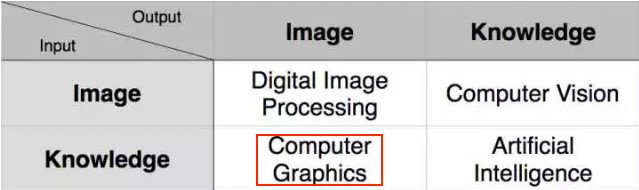
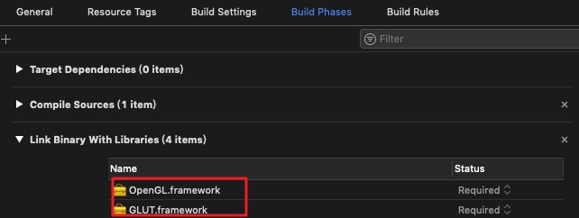
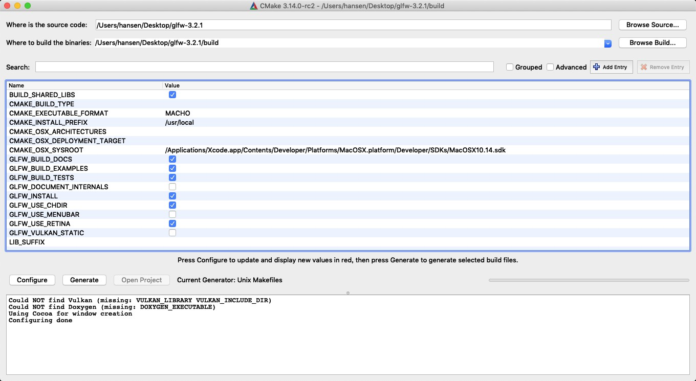
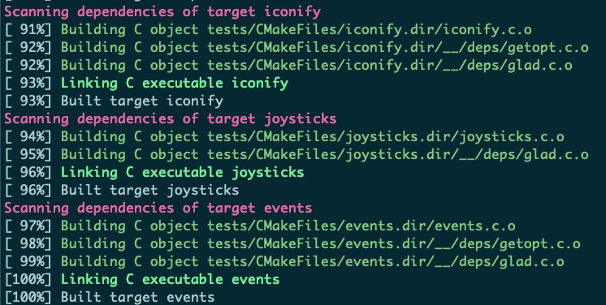
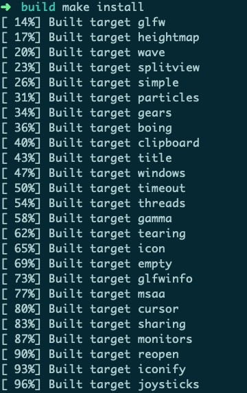
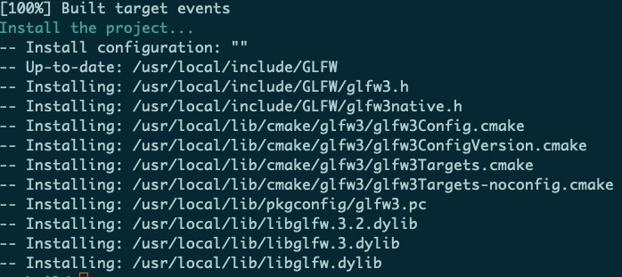
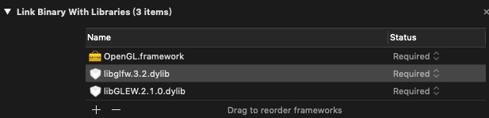
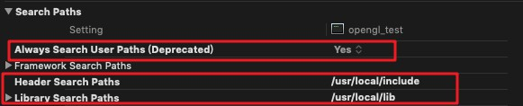
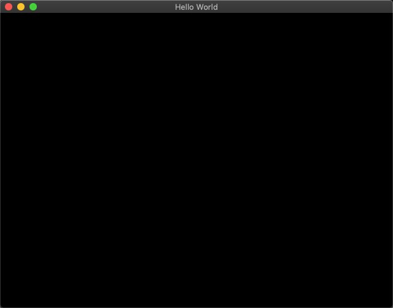

# Homework 1 - Learning about CG

## Basic:

回答下面的问题：

1. 结合上述参考链接（或其他参考资料），谈谈自己对计算机图形学的理解。

   

   在 CV 领域，一般研究的是逆向问题，即并不存在一套明确的映射构建方式或规则，或者说这种规则很难形式化描述，人们只能够依据数据驱动的方式来枚举出所有的对应关系，从中得到规律和经验知识。上学期的DIP一般用于改善图像质量，比如去噪或者增强，并对现有图像进行数学上的分析，而CG则使用计算机生成图形，可以根据人们的主观意愿和想象制作出丰富的图形图像以及一些逼真的动画。其中可以分为建模，渲染，动画和人机交互几个部分。其早起应用于显示简单的数据图，现在的主要应用为CAD（计算机辅助设计），比如autodesk公司的许多软件（Maya），可以对设计对象首先进行点线面轮廓的建模，然后进行渲染，还可以加入动画等。而VR中的虚拟场景是用CG模拟出的三维图形空间，并使用户能够自然地与该空间进行交互。包括一些数据可视化和GUI的窗口也用到的计算机图形学的技术，最后在视听娱乐中，比如动画片的制作和游戏特效的场景，一些拟人化角色也需要CG完成，总之用途非常广泛。

​	

2. 结合上述参考链接（或其他参考资料），回答什么是OpenGL? OpenGL ES? Web GL? Vulkan? DirectX?

   **OpenGL：**

   OpenGL是一个图形API，包含了一系列可以操作图形、图像的函数。然而，OpenGL本身并不是一个API，它仅仅是一个由[Khronos组织](http://www.khronos.org/)制定并维护的规范(Specification)。因为OpenGL规范并没有规定实现的细节，具体的OpenGL库允许使用不同的实现，其开发者通常是显卡的生产商。但其功能和结果要与规范相匹配（即作为用户不会感受到功能上的差异）。

   

   **OpenGL ES：**

   OpenGL ES (OpenGL for Embedded Systems) 是 OpenGL 的子集，OpenGL ES 相对 OpenGL 删减了一切低效能的操作方式，但同时也降低了兼容性。针对手机、PDA和游戏主机等嵌入式设备而设计，因为这些硬件设备的工作环境较为恶劣，OpenGL ES提高了OpenGl的性能，该API由Khronos组织定义推广。

   

   **Web GL：**

   WebGL是一种JavaScript API，用于在任何兼容的Web浏览器中呈现交互式3D和2D图形，而无需使用插件。WebGL通过引入一个与OpenGL ES 2.0紧密相符合的API，可以为 HTML5 Canvas 提供硬件3D加速渲染，这样Web开发人员就可以借助系统显卡来在浏览器里更流畅地展示3D场景和模型了，还能创建复杂的导航和数据视觉化。显然，WebGL技术标准免去了开发网页专用渲染插件的麻烦，可被用于创建具有复杂3D结构的网站页面，甚至可以用来设计3D网页游戏等等。

   

   **Vulkan：**

   Vulkan是一个跨平台的 2D 和 3D 绘图 API，最早由Khronos组织在2015年游戏开发者大会 GDC 上发表，其把Vulkan API称为“次世代OpenGL行动”（next generation OpenGL initiative）或“glNext”，Vulkan提供了高性能和低CPU管理负担（overhead）。

   

   **DirectX：**

   DirectX，（Direct eXtension，简称DX）是由 Microsoft 创建的多媒体 API ，由C++实现，遵循COM。被广泛使用于 Windows 、Microsoft XBOX、Microsoft XBOX 360 和 Microsoft XBOX ONE电子游戏开发，并且只能支持这些平台。


3. gl.h glu.h glew.h 的作用分别是什么?

   **<GL/gl.h>：**

   OpenGL  1.1 所使用的函数和常量的头文件声明。OpenGL的基本头文件，如果要使用1.1版之外的任何功能，则必须添加扩展库。

   

   **<GL/glu.h>：**

   OpenGL Utilities Library，很长时间没有更新。一般不需要使用此头文件。

   

   **<GL/glew.h>：**

   OpenGL Extension Wrangler Library。这是一个用于加载 OpenGL 扩展功能的跨平台库。OpenGL 的一大特性就是对扩展(Extension)的支持，当一个显卡公司提出一个新特性或者渲染上的大优化，通常会以扩展的方式在驱动中实现。如果一个程序在支持这个扩展的显卡上运行，开发者可以使用这个扩展提供的一些更先进更有效的图形功能。初始化此库时，它将检查运行时的平台和图形卡，以了解可在程序中使用的功能。只要包含一个glew.h头文件，就能使用gl,glu,glext,wgl,glx的全部函数。支持目前流行的各种操作系统。


4. 使用 GLFW 和 freeglut 的目的是什么？

    GLFW（**G**raphics **L**ibrary **F**rame**w**ork）是一个轻量级的，开源的，跨平台的library。支持OpenGL及OpenGL ES，用来管理窗口，读取输入，处理事件等。

    freeglut是GLUT的一个完全开源替代库。因为OpenGL没有窗口管理的功能，所以很多人写了工具来支持这些功能，比如早期的glut，现在的freeglut等。glut太老了，最后一个版本还是90年代的。freeglut完全兼容glut，算是glut的代替品，功能齐全，但是bug太多。稳定性也不好，GLFW应运而生。（[两者区别](https://stackoverflow.com/questions/25708688/what-is-the-difference-between-freeglut-vs-glfw)）	


5. 结合上述参考链接（或其他参考资料），选择一个SIGGRAPH 2017/2018上 你最喜欢的专题，介绍该专题是做什么的，使用了什么CG技术？（不少于100字）

   深度学习目前尚未席卷 CG 领域，是因为传统神经网络模型一般针对的是 2D 的训练图片，而还没有一个专为3D 图形数据而设计的深度学习模型（就像专为图片设计的深度卷积神经网络 CNN）。在2017年的SIGGRAPH会议上，[Convolutional Neural Networks on Surfaces via Seamless Toric Covers]( https://dl.acm.org/citation.cfm?id=3073616) 在 3D 模型的表面定义了一种卷积运算（convolution），它可以理解成是把表示 3D 模型表面数据的 mesh 在 2D 平面上展开（parameterize）成图片，作为CNN的输入。而封闭的 3D 模型表面必须经过切割才能在 2D 平面上无重叠地展开，为了让原本在 3D 模型上相邻但由于切割而在展开的 2D 图片上分离的数据也能够一块经历同尺度的卷积运算，他们通过一种映射生成了原始模型的4块方形展开图（称为covers），并将切割处拼接起来形成最终的图片。该方法能够应用到人体 3D 模型语义分割（human shape segmentation）以及解剖形体的对应问题（anatomic shape correspondence）上，并且准确度较前人方法有所提升。

   


## Optional:

下次作业将正式开始编程写代码（第一次编程作业量可能稍大= =），所以若大家有时间可以先按照上面提到的那个learnopengl教程官网先配置环境，接触一下OpenGL编程。


Enviroment：

```
macOS 10.14.2
Intel HD Graphics 6000 1536 MB
Xcode 10.1 
```


1. 如前所述，GLFW和GLUT都是跨平台的OpenGl Library，其中在project的build phases中加入以下两个framework就可以使用以下GLUT的头文件了。

   ```cpp
   #include <OpenGL/gl.h> 
   #include <OpenGL/glu.h> 
   #include <GLUT/glut.h> 
   ```




2. 但由于GLUT版本较老，已经停止更新了，所以下面配置GLFW和GLEW，如前所述，GLEW能自动识别你的平台所支持的全部OpenGL高级扩展函数。也就是说，只要包含一个glew.h头文件，你就能使用gl,glu,glext,wgl,glx的全部函数。而GLFW无愧于其号称的lightweight的OpenGL框架，的确是除了跨平台必要做的事情都没有做，所以一个头文件，很少量的API，就完成了任务。GLFW的开发目的是用于替代GLUT的。

   可以选择`brew install glfw3`直接安装GLFW或者[下载源码](https://www.glfw.org/download.html)并使用[cmake](https://cmake.org/)生成编译链接需要的makefile，最后安装到`/usr/local/lib`中

   


3. 在下载源码后的目录configure并且generate后，进入`build`目录进行`make` 和`make install`

   

   

   


4. 下载[GLEW](http://glew.sourceforge.net/)，`make install`进行安装

5. 在Xcode项目中的build phases link安装好的库

   

6. build setting 如下设置

   

7. 测试源码如下

   ```c++
   #include <iostream>
   #include <GL/glew.h>
   #include <GLFW/glfw3.h>
   int main(void){
       
       GLFWwindow* window;
       /* Initialize the library */
       if (!glfwInit())
           return -1;
       
       /* Create a windowed mode window and its OpenGL context */
       window = glfwCreateWindow(640, 480, "Hello World", NULL, NULL);
       if (!window){
           glfwTerminate();
           return -1;
       }
       
       /* Make the window's context current */
       glfwMakeContextCurrent(window);
   
       /* Loop until the user closes the window */
       while (!glfwWindowShouldClose(window)){
           
           /* Render here */
           
           /* Swap front and back buffers */
           glfwSwapBuffers(window);
   
           /* Poll for and process events */
           glfwPollEvents();
       }
       glfwTerminate();
       return 0;
   }
   ```

   

   