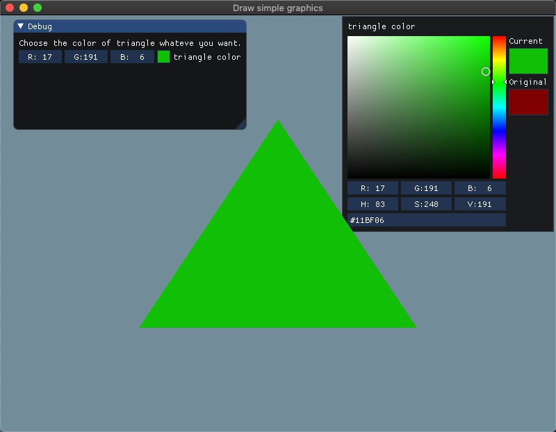

[TOC]

# Homework 2 - GUI and Draw simple graphics

**演示结果见 /doc 中的 demo.gif**


## 开发环境

```c++
// 在初始化及创建窗口后查看OpenGl版本
std::cout << "OpenGL Vendor: " << glGetString(GL_VENDOR) << std::endl;
std::cout << "OpenGL Renderer: " << glGetString(GL_RENDERER) << std::endl;
std::cout << "OpenGL Version: " << glGetString(GL_VERSION) << std::endl;
```

```
OpenGL Vendor: Intel Inc.
OpenGL Renderer: Intel(R) HD Graphics 6000
OpenGL Version: 4.1 INTEL-12.4.7
glfw 3.3
glew 2.1.0
```

## Basic:

1. 使用OpenGL(3.3及以上)+GLFW或freeglut画一个简单的三角形。
2. 对三角形的三个顶点分别改为红绿蓝，像下面这样。并解释为什么会出现这样的结果。
3. 给上述工作添加一个GUI，里面有一个菜单栏，使得可以选择并改变三角形的颜色。

### 效果图





### 实现步骤

#### 1. 画一个简单三角形，并对三角形的三个顶点分别改为红绿蓝

[教程参考](https://learnopengl.com/Getting-started/Hello-Triangle)

1. 首先使用 *OpenGL着色器语言(OpenGL Shading Language, GLSL)* 编写 shader 程序

   根据[教程](https://learnopengl.com/Getting-started/Shaders)构建自己的 shader 类如下，可以编写、编译、管理着色器，并进行错误检测。

   ```c++
   #ifndef Shader_h
   #define Shader_h
   
   #include <glad/glad.h> // include glad to get all the required OpenGL headers
   #include <GLFW/glfw3.h>
   #include <iostream>
   #include <string>
   #include <fstream>
   #include <sstream>
   using namespace std;
   
   class Shader {
   public:
       // the program ID
       GLuint shaderProgramID;
   
       // constructor reads and builds the shader
       Shader(const GLchar* vsPath, const GLchar* fsPath);
       
       // use/activate the shader
       void use();
   
       // utility uniform functions
       void setBool(const string &name, bool value) const;  
       void setInt(const string &name, int value) const;   
       void setFloat(const string &name, float value) const;
       void setFloat4(const string &name, float vec[4]) const;
   };
   
   #endif /* Shader_h */
   ```

   在 Shader 文件夹中编写顶点和片段着色器，在 main 中使用如下语句即可对 shader 进行读入，编译和链接

   ```c++
   Shader shader = Shader("Shader/basic.vs", "Shader/basic.fs");
   ```

   ​	

2. 主要理解以下三个概念，**注意先开始绑定VAO，之后的VBO和EBO会自动绑定到该VAO上**

   - 顶点数组对象：Vertex Array Object，VAO
   - 顶点缓冲对象：Vertex Buffer Object，VBO
   - 索引缓冲对象：Element Buffer Object，EBO或Index Buffer Object，IBO

   

   初始化如下

   ```c++
    GLuint VBO[3], VAO[3], EBO[2];
    glGenVertexArrays(3, VAO);
    glGenBuffers(3, VBO);
    glGenBuffers(2, EBO);
   ```

   

3. 在 main 中以 float 数组的形式传递 6 个3D坐标作为图形渲染管线的输入，用来表示一个三角形的三个顶点坐标和颜色，这个数组叫做顶点数据(Vertex Data)

   ```c++
   // set up vertex data (and buffer(s)) and configure vertex attributes
   // ------------------------------------------------------------------
   float vertices1[] = {
       // positions         // colors
       0.5f, -0.5f, 0.0f,  0.0f, 0.0f, 1.0f,// bottom right
       -0.5f, -0.5f, 0.0f,  0.0f, 1.0f, 0.0f,   // bottom left
       0.0f,  0.5f, 0.0f,  1.0f, 0.0f, 0.0f    // top 
   };   
   ```

   

4. 顶点数组对象(Vertex Array Object, VAO) 根据我的理解就是指针数组，在绑定后指向 VBO 中存储的真正顶点数据。这样的好处就是，当配置顶点数据指针时，你只需要将那些调用执行一次，之后再绘制物体的时候只需要得到相应的 VAO （指针） 就可以得到存储在 VBO 中的数据了。OpenGL的核心模式**要求**我们使用VAO，所以它知道该如何处理我们的顶点输入。如果我们绑定VAO失败，OpenGL会拒绝绘制任何东西。

   ```c++
   // ..:: 初始化代码（只运行一次 (除非你的物体频繁改变)） :: .
   
   // draw choice 1
   // draw the triangle
   // bind the Vertex Array Object first, then bind and set vertex buffer(s), and then configure vertex attributes(s).
   glBindVertexArray(VAO[0]);
   
   glBindBuffer(GL_ARRAY_BUFFER, VBO[0]);
   glBufferData(GL_ARRAY_BUFFER, sizeof(vertices1), vertices1, GL_STATIC_DRAW);
   
   // position attribute
   glVertexAttribPointer(0, 3, GL_FLOAT, GL_FALSE, 6 * sizeof(float), (void*)0);
   glEnableVertexAttribArray(0);
   // color attribute
   glVertexAttribPointer(1, 3, GL_FLOAT, GL_FALSE, 6 * sizeof(float), (void*)(3* sizeof(float)));
   glEnableVertexAttribArray(1);
   
   // note that this is allowed, the call to glVertexAttribPointer registered VBO as the vertex attribute's bound vertex buffer object so afterwards we can safely unbind
   glBindBuffer(GL_ARRAY_BUFFER, 0);
   // You can unbind the VAO afterwards so other VAO calls won't accidentally modify this VAO, but this rarely happens. Modifying other
   // VAOs requires a call to glBindVertexArray anyways so we generally don't unbind VAOs (nor VBOs) when it's not directly necessary.
   glBindVertexArray(0);
   ```

   

5. 最后在渲染循环中先绑定 VAO，然后画三角形的图元，最后再解绑。

   ```c++
   shader.use();
   // bind the VAO 
   glBindVertexArray(VAO[0]);
   // now render the triangle
   glDrawArrays(GL_TRIANGLES, 0, 3);
   // unbind VAO every time
   glBindVertexArray(0);
   ```


6. 要想实现红绿蓝颜色的三角形效果，由于之前在主程序中已经将 RGB 颜色绑定到三个顶点的颜色属性中，需要在 GLSL 代码中用一个 ourColor 变量将顶点着色器和片段着色器联系起来。

   ```c
   #version 330 core
   layout (location = 0) in vec3 aPos;   // the position variable has attribute position 0
   layout (location = 1) in vec3 aColor; // the color variable has attribute position 1
     
   out vec3 ourColor; // output a color to the fragment shader
   
   void main()
   {
       gl_Position = vec4(aPos, 1.0);
       ourColor = aColor; // set ourColor to the input color we got from the vertex data
   }       
   ```

   ```c
   #version 330 core
   out vec4 FragColor;
   in  vec3 ourColor;
   uniform vec4 gui_color;
   
   void main()
   {
        FragColor = vec4(ourColor,1.0);
   //    FragColor = gui_color;
   }
   ```


**解释为什么会出现这样的结果**

[参考](https://learnopengl-cn.github.io/01%20Getting%20started/05%20Shaders/)

是在片段着色器中进行的所谓 **片段插值 (Fragment Interpolation)** 的结果。当渲染一个三角形时，光栅化(Rasterization) 阶段通常会造成比原指定顶点更多的片段。光栅会根据每个片段在三角形形状上所处相对位置决定这些片段的位置。
基于这些位置，它会 **插值(Interpolate)** 所有片段着色器的输入变量。比如说，我们有一个线段，上面的端点是绿色的，下面的端点是蓝色的。如果一个片段着色器在线段的70%的位置运行，它的颜色输入属性就会是一个绿色和蓝色的线性结合；更精确地说就是 30% 蓝 + 70% 绿。

这正是在这个三角形中发生了什么。我们有3个顶点，和相应的3个颜色，从这个三角形的像素来看它可能包含50000左右的片段，片段着色器为这些像素进行插值颜色。如果你仔细看这些颜色就应该能明白了：红首先变成到紫再变为蓝色。片段插值会被应用到片段着色器的所有输入属性上。


#### 2. 给上述工作添加一个GUI，里面有一个菜单栏，使得可以选择并改变三角形的颜色

```
example_glfw_opengl3/
    GLFW (Win32, Mac, Linux) + OpenGL3+/ES2/ES3 example (programmable pipeline).
    = main.cpp + imgui_impl_glfw.cpp + imgui_impl_opengl3.cpp
    This uses more modern OpenGL calls and custom shaders.
    Prefer using that if you are using modern OpenGL in your application (anything with shaders).
```

下载 ImGui 的[源码](https://github.com/ocornut/imgui)并根据[example_glfw_opengl3 例子](https://github.com/ocornut/imgui/blob/master/examples/example_glfw_opengl3/main.cpp)进行使用


 1. 更改 fragment shader 程序，设置 uniform 变量 gui_color ，通过GUI修改的 RGB 颜色值，用来渲染三角形的颜色

    ```c
    #version 330 core
    out vec4 FragColor;
    in  vec3 ourColor;
    uniform vec4 gui_color;
    
    void main()
    {
    //     FragColor = vec4(ourColor,1.0);
        FragColor = gui_color;
    }
    ```

	2. 在主程序中加入主菜单，通过组件 ImGui::ColorEdit3 去改变 gui_color 的值从而实现对三角形颜色的改变。

    ```c++
    ImGui::Begin("Menu");
    ImGui::Text("Make a choice below.");
    if (ImGui::Button("Draw triangle")){
        choice = 1;
    }
    if (ImGui::Button("Line")){
        choice = 2;
    }
    if (ImGui::Button("Rectangle")){
        choice = 3;
    }
    
    switch (choice) {
        case 1:
            // choose the color of triangle
            ImGui::Text("Choose the color of triangle whateve you want.");
            ImGui::ColorEdit3("triangle color", (float*)&tri_color); // Edit 3 floats representing a color
            break;
        case 2:
            ImGui::Text("A cross will be drawed.");
            break;
        case 3:
            ImGui::Text("A rectangle will be drawed.");
            break;
        default:
            break;
    }
    ImGui::End();
    ```

	3. 最后在渲染循环中设置 uniform变量传递给 shader

    ```c++
    // be sure to activate the shader
    shader.use();
    float curr_tri_color[4];
    curr_tri_color[0] = tri_color.x;
    curr_tri_color[1] = tri_color.y;
    curr_tri_color[2] = tri_color.z;
    curr_tri_color[3] = tri_color.w;
    shader.setFloat4("gui_color", curr_tri_color);
    // now render the triangle
    glBindVertexArray(VAO[0]);
    glDrawArrays(GL_TRIANGLES, 0, 3);
    ```

    


## Bonus:

### 效果图


### 实现步骤

#### 1. 绘制其他的图元，除了三角形，还有点、线等。

 1. 新建 shader 源码，在 fragment shader 中可以修改变量值以修改线和矩形的颜色

 2. 在主程序中新建两条交叉线的 4 个顶点数据和索引数据并绑定到不同的 VAO ，VBO 和 EBO中

    ```c++
    float vertices2[] = {
        -0.4f, 0.4f, 0.0f,
        -0.4f, -0.4f, 0.0f,
        0.4f, -0.4f, 0.0f,
        0.4f, 0.4f, 0.0f
    };
    unsigned int indices1[] = {
        0, 2,
        1, 3
    };
    ```

3. 更改图元属性值为 GL_LINES，并使用 glDrawElements （[API](http://docs.gl/)） ，根据 indices1 指定的顶点顺序渲染出交叉线

   ```c++
   shader_bonus.use();
   glBindVertexArray(VAO[1]);
   glDrawElements(GL_LINES, 4, GL_UNSIGNED_INT, 0);
   ```

   

#### 2. 使用EBO(Element Buffer Object)绘制多个三角形。

 1. 同样利用 EBO 思想，四个顶点依照顺序渲染出两个直角三角形组成一个矩形

    ```c++
     // draw a rectangle
     float vertices3[] = {
         0.5f,  0.5f, 0.0f,  // top right
         0.5f, -0.5f, 0.0f,  // bottom right
         -0.5f, -0.5f, 0.0f,  // bottom left
         -0.5f,  0.5f, 0.0f   // top left
     };
     unsigned int indices2[] = {  // note that we start from 0!
         0, 1, 3,   // first triangle
         1, 2, 3    // second triangle
     };
    ```

    ```c++
    shader_bonus.use();
    glBindVertexArray(VAO[2]);
    glDrawElements(GL_TRIANGLES, 6, GL_UNSIGNED_INT, 0);
    ```

    


