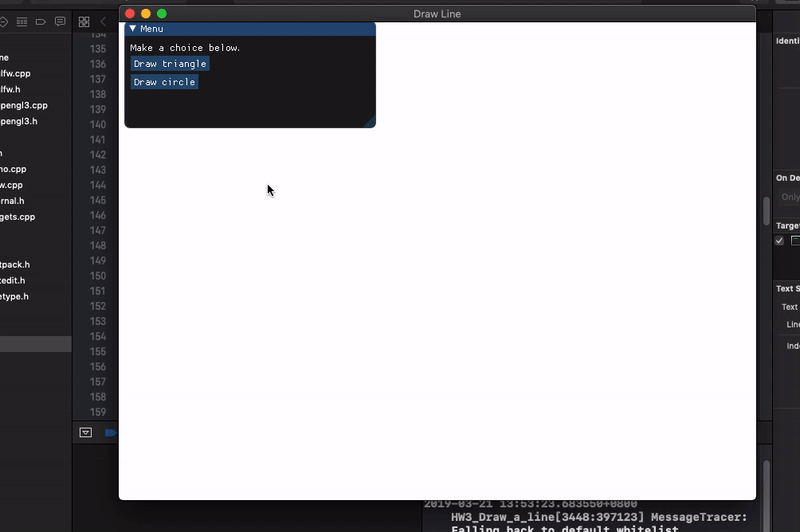
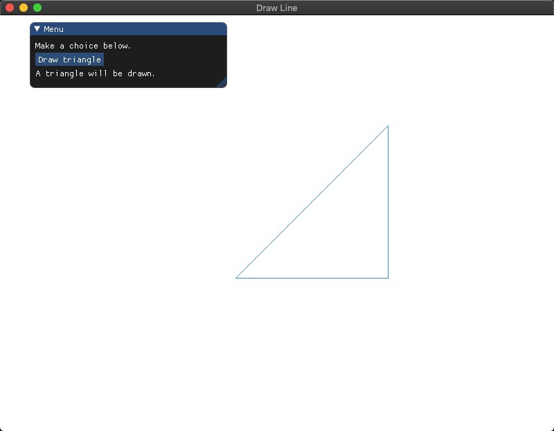
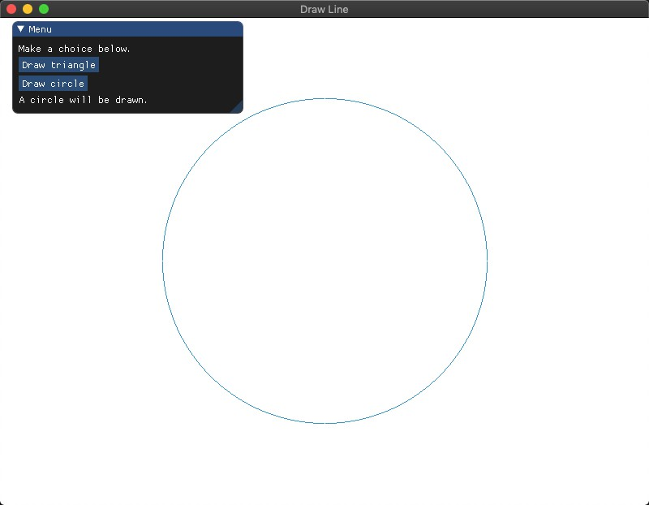
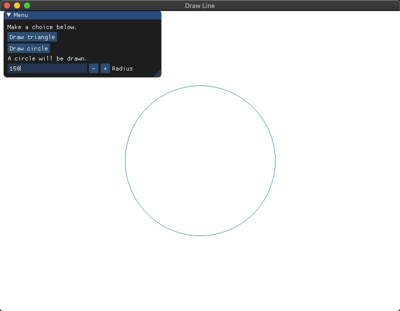
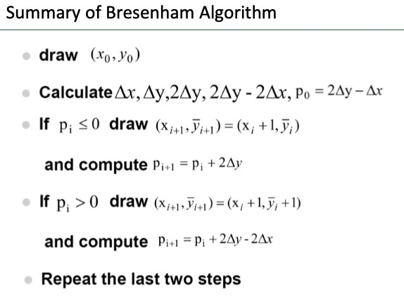
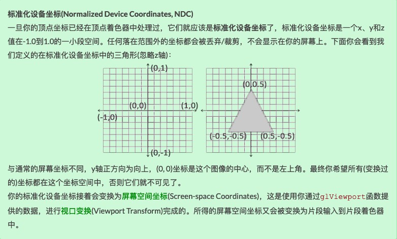
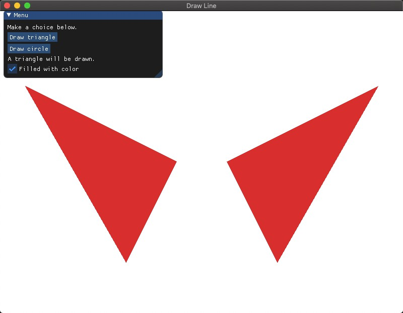
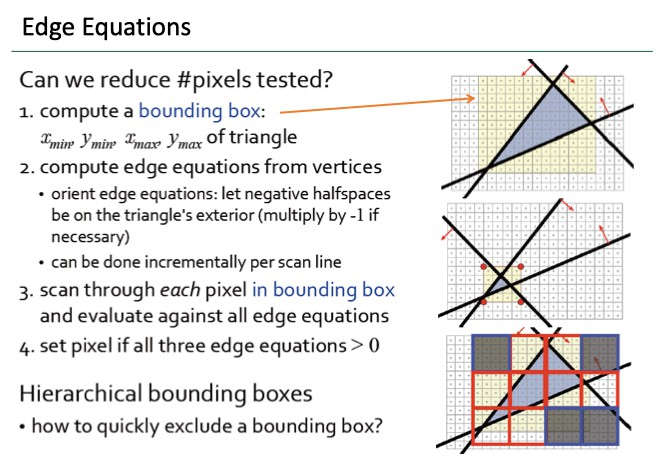
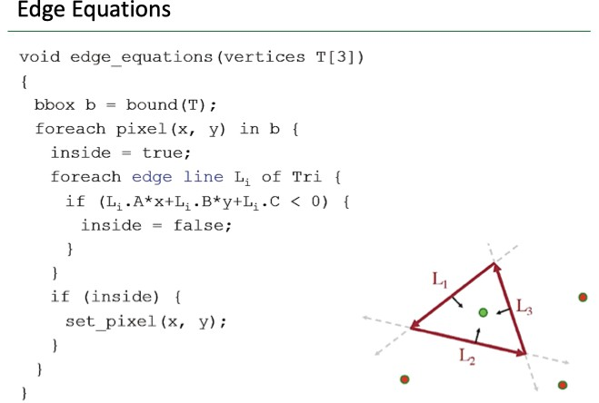
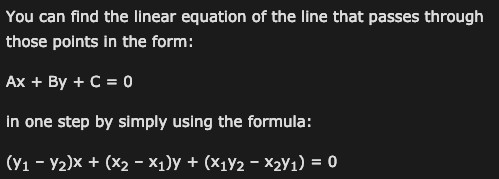

[TOC]

# Homework 3 - Draw line

**演示结果见 /doc 中的 demo.gif**




## Basic

### 效果图








### 实现步骤

#### 一、使用Bresenham算法(只使用integer arithmetic)画一个三角形边框：input为三个2D点；output三条直线（要求图元只能用 GL_POINTS ，不能使用其他，比如 GL_LINES 等）。

1. 编译配置和有关 GUI 的代码框架已经在上次项目中搭建好，此次实验只需根据输入的三角形顶点坐标，然后使用 Bresenham 算法生成组成 line 的所有像素点的整数坐标，最后使用 GL_POINT 进行渲染即可。

2. 对于任意两点 v0 和 v1，直线 v0v1 的斜率范围为 （-∞，+∞） ，课件中的算法过程如下，但其前提条件为直线的斜率在 [0,1]。

   

3. 对于其他情况，可以先将坐标通过对称变换转换到上述情况下，再进行绘制，最后将线上所有点的坐标进行逆变换。注意要先保证 v0 的横坐标小于等于 v1 的横坐标，即 dx >= 0。

   - 当斜率在 （1,+∞）时，即 dy > dx，且 dy > 0 时，将顶点坐标关于 y = x 进行对称变换
   - 当斜率在  [-1,0）时，即 dy < dx，且 dy < 0 时，将顶点坐标关于 y = v0.y 进行对称变换
   - 当斜率在 （-∞,1）时，即 dy > dx，且 dy < 0 时，将顶点坐标关于 y = v0.y 进行对称变换，转到第一种情况，然后再关于 y = x 进行变换，两次变换可以调换顺序。

   ```c++
    if (v0.x > v1.x) {
    	swap(v0, v1);
    }
    bool isFlipXY = false;
    bool isFlipX = false;
   
   // slope greater than 1 or less than -1
   if (abs(v0.x - v1.x) < abs(v0.y - v1.y)) {
   	flipXY(v0);
   	flipXY(v1);
   	isFlipXY = true;
   }
   
   if (v0.x > v1.x) {
   	swap(v0, v1);
   }
   
   // slope between -1 and 0
   if (v0.y > v1.y) {
   	flipX(v0, v1);
   	isFlipX = true;
   }
   ```

4. OpenGL 仅当3D坐标在3个轴（x、y和z）上都为-1.0到1.0的范围内时才处理它。所有在所谓的标准化设备坐标(Normalized Device Coordinates)范围内的坐标才会最终呈现在屏幕上（在这个范围以外的坐标都不会显示）。而由于算法处理的坐标为屏幕空间上的像素坐标，需要除以窗口的维度进行标准化，然后再绑定到 VAO 和 VBO中供 Shader 渲染。

   

   

#### 二、使用Bresenham算法(只使用integer arithmetic)画一个圆：input为一个2D点(圆心)、一个integer半径； output为一个圆。

[参考](https://www.geeksforgeeks.org/bresenhams-circle-drawing-algorithm/)

1.  由于 circle 的对称性，只需画 1/8 个圆，其他圆弧上的点可以对称得到

   

   ```c++
   void addCirclePoints(vector<Point>& pv,const Point& centre,const int& x,const int& y){
       vector<Point> eightPoints = {
           Point(centre.x + x, centre.y + y), 
           Point(centre.x - x, centre.y + y),
           Point(centre.x + x, centre.y - y), 
           Point(centre.x - x, centre.y - y),
           Point(centre.x + y, centre.y + x), 
           Point(centre.x - y, centre.y + x),
           Point(centre.x + y, centre.y - x), 
           Point(centre.x - y, centre.y - x)
       };
       pv.insert(pv.end(), eightPoints.begin(), eightPoints.end());
   }
   ```

   

2. 画圆弧的具体思想和之前画 line 相同，初始化 decision parameter d = 3 - (2 * radius)，然后每次根据 d 的大小选择 （x+1,y）或者（x+1,y-1）

   

```c++
vector<Point> pv;
int x = 0,y = radius,d = 3 - (2*radius);
addCirclePoints(pv,centre,x,y);

while(x < y){
  if(d < 0){
  	d = d + 4 * x + 6;
  }
  else{
  	d = d + 4 * (x - y) + 10;
  	y--;
  }
  x++;
  addCirclePoints(pv,centre,x,y);
}
```


#### 三、在GUI在添加菜单栏，可以选择是三角形边框还是圆，以及能调整圆的大小(圆心固定即可)。

1. 选择菜单在上次实验中已经实现，具体就是绑定多个 VAO 和 VBO，在渲染循环中根据用户选择来渲染不同 VAO 中的点的图元。注意每次渲染后需要解绑。
2. 在画圆菜单中添加 ImGui::InputInt 并绑定到 curr_radius 变量，当发现 curr_radius 和当前的 radius 不同时，重新绘制新的点并绑定到 VAO 中，然后更新 radius。

```c++
case 2:
  ImGui::Text("A circle will be drawn.");
  ImGui::InputInt("Radius", &curr_radius);
  if(curr_radius != radius){
    circleData.clear();
    circleData = genCirclePositions(centre,curr_radius);
    radius = curr_radius;
    for (int i = 0; i < circleData.size(); i = i + 3) {
   	 circleData[i] = 2 * circleData[i] / SCR_WIDTH;
   	 circleData[i + 1] = 2 * circleData[i + 1] / SCR_HEIGHT;
  }
  // bind the VAO, VBO with points
  PointsBindVAO(VAO[1],VBO[1],circleData);
  }
	break;
```


## Bonus

### 效果图




### 实现步骤

#### 一、使用三角形光栅转换算法，用和背景不同的颜色，填充你的三角形。

1.  Edge Equations 算法

   

   

   

2. [通过两点计算直线一般式](https://bobobobo.wordpress.com/2008/01/07/solving-linear-equations-ax-by-c-0/)

   

3. 设置 flag，保证 negative halfspace 在三角形的外部

   ```c++
   float deterValue(const vector<float>& line,const Point& p){
   	return line[0] * p.x + line[1] * p.y + line[2];
   }
   // orient edge equations
   // let negative halfspaces be on the triangle's exterior
   int flags[3];
   // determine the value of v2 on line v0v1
   flags[0] = (deterValue(lines[0], v2) > 0)? 1 : -1;
   // determine the value of v1 on line v0v2
   flags[1] = (deterValue(lines[1], v1) > 0)? 1 : -1;
   // determine the value of v0 on line v1v2
   flags[2] = (deterValue(lines[2], v0) > 0)? 1 : -1;
   ```

   

