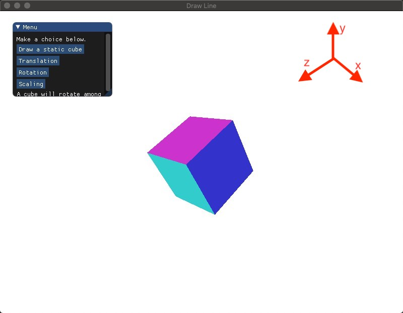

[TOC]

# Homework 4 - Transformation

## Basic:

> HINT：
>
> - 调用 glClear(GL_DEPTH_BUFFER_BIT) ，然后使用 glEnable(GL_DEPTH_TEST) 激活深度测试。
> - 可以使用GLFW时间函数 glfwGetTime() ，或者 <math.h> 、 <time.h> 等获取不同的数值


**效果图见 demo.gif**


------


### 算法概述

1. 在三维[仿射空间](https://en.wikipedia.org/wiki/Affine_space)中，为了区别向量和点的坐标，引入了四维的齐次坐标（Homogeneous coordinates）：(x,y,z,w)。

   - 若 w == 1，则向量 (x, y, z, 1) 为空间中的点。
   - 若 w == 0，则向量 (x, y, z, 0) 为空间中的向量。

   其优点有许多，其中一点是所有变换，如位移，旋转和缩放可以使用 4 x 4 的矩阵乘法完成，原因在于在仿射空间中，每一帧由一组线性无关的正交基和一个坐标原点确定（即`坐标系=(基向量，原点O)`），所以两个不同帧之间的 4 维坐标变换就需要由 4 x 4 的矩阵完成，具体证明在课件中。

   

2. OpenGL 需要把 3D 图形映射到 2D 屏幕，下面是 OpenGL 坐标变换所要完成的工作流程：

   

   - Model Coordinates： 定义的输入顶点一般是以此坐标表示的 3D 模型。本地坐标是为了研究孤立的3D模型，**坐标原点一般都是模型的中心**。**每个 3D 模型都有自己的本地坐标系（Model Coordinate），互相之间没有关联。**

   - World Coordinates：当需要同时渲染多个 3D 物体时，需要把不同的3D模型，变换到一个统一的坐标系，这就是世界坐标系（World Coordinate）。**把物体从本地坐标系变换到世界坐标系，是通过一个`Model`矩阵完成的。**模型矩阵可以实现多种变换：平移(translation)、缩放(scale)、旋转(rotation)、镜像(reflection)、错切(shear)等。例如：**通过平移操作，我们可以在世界坐标系的不同位置绘制同一个3D模型** 

   - Camera Coordinates：世界坐标系中的多个物体共同构成了一个 3D 场景。从不同的角度观察这个 3D 场景，我们可以看到不同的屏幕投影。OpenGL提出了摄像头坐标系的概念，即从摄像头位置来观察整个 3D场景。**把物体从世界坐标系变换到摄像头坐标系，是通过一个`View`矩阵完成的。**

   - Homogeneous Coordinates：因为我们是从一个 2D 屏幕观察 3D 场景，而屏幕本身不是无限大的。所以当从摄像头的角度观察 3D 场景时，可能无法看到整个场景，这时候就需要把看不到的场景裁减掉。**投影变换就是负责裁剪工作，投影矩阵指定了一个视见体或叫平截头体 (View Frustum)，在视见体内部的物体会出现在投影平面上，而在视见体之外的物体会被裁减掉。**投影包括很多类型，OpenGL中主要考虑透视投影 (Perspective Projection) 和正交投影 (Orthographic Projection) ，[区别](https://learnopengl-cn.github.io/01%20Getting%20started/08%20Coordinate%20Systems/#_6)。**通过`Projection`矩阵，可以把物体从摄像头坐标系变换到裁剪坐标系。在裁剪坐标下，X、Y、Z各个坐标轴上会指定一个可见范围，超过可见范围的顶点(vertex)都会被裁剪掉。**

   - Normalized Device Coordinates：每个裁剪坐标系指定的可见范围可能是不同的，为了得到一个统一的坐标系，**需要对裁剪坐标进行透视除法（Perspective Division），得到NDC坐标(Normalized Device Coordinates - 标准化设备坐标系)。透视除法就是将裁剪坐标除以齐次分量`W`，得到NDC坐标，在NDC坐标系中，X、Y、Z各个坐标轴的区间是[-1,1]。因此，可以把NDC坐标系看做作一个边长为2的立方体，所有的可见物体都在这个立方体内部。 **

   - Screem Coordinates：NDC坐标系的范围是[-1,1]，最后需要通过`glViewport`指定绘制区域的坐标和宽高，系统会自动完成视口变换。经过视口变换，我们就得到了 2D 屏幕上的屏幕坐标。需要注意的是：**屏幕坐标与屏幕的像素位置是不一样的，屏幕坐标是屏幕上任意一个顶点的精确位置，可以是任意小数。但是像素位置只能是整数（具体的某个像素）。这里的视口变换是从 NDC 坐标变换到屏幕坐标，还没有生成最终的像素位置。从屏幕坐标映射到对应的像素位置，是后面光栅化完成的。**

     ------

     在OpenGL中， **本地坐标系、世界坐标系和摄像头坐标系都属于右手坐标系，而最终的裁剪坐标系和标准化设备坐标系属于左手坐标系。** 
     左右手坐标系的示意图如下所示，其中大拇指、食指、其余手指分别指向 x,y,z 轴的正方向。

     


### 1. 画三维立方体

*画一个立方体 (cube)：边长为 4， 中心位置为 (0, 0, 0)。分别启动和关闭深度测试 glEnable(GL_DEPTH_TEST) 、 glDisable(GL_DEPTH_TEST) ，查看区别，并分析原因。*

#### 效果图

开启深度测试


关闭深度测试


#### 具体实现

1. 首先定义顶点数组，**其三维坐标以本地坐标系为参考系**，立方体一共 6 个面，中心在原点，每个正方形使用两个三角形图元进行渲染，所以一个面由 6 个顶点定义，总共定义 36 个顶点。为了区分每个面，添加 RGB 的颜色属性。

```c++
// #36 3D vertices
float vertices1[] = {
  // 背面
   -2.0f, -2.0f, -2.0f,  0.8f, 0.2f, 0.2f,
   2.0f, -2.0f, -2.0f,   0.8f, 0.2f, 0.2f,
   2.0f,  2.0f, -2.0f,   0.8f, 0.2f, 0.2f,
   2.0f,  2.0f, -2.0f,   0.8f, 0.2f, 0.2f,
   -2.0f,  2.0f, -2.0f,  0.8f, 0.2f, 0.2f,
   -2.0f, -2.0f, -2.0f,  0.8f, 0.2f, 0.2f,
  ...
}
```


2. 创建模型观察投影（MVP）矩阵。需要注意的是定义需要在渲染循环中完成。

```c++
 // use glm for matrix transformation
glm::mat4 model; // default initialize as an identity matrix
glm::mat4 view;
glm::mat4 projection;
        
// Camera matrix
view = glm::lookAt(
  glm::vec3(10.0f, 10.0f, 10.0f), // the position of your camera, in world space
  glm::vec3(0.0f, 0.0f, 0.0f), // where you want to look at, in world space
  glm::vec3(0.0f, 1.0f, 0.0f)  // probably glm::vec3(0,1,0), but (0,-1,0) would make you looking upside-down, which can be great too
);

// Projection matrix 
projection = glm::perspective(
  45.0f, // The vertical Field of View, in radians: the amount of "zoom". Think "camera lens". Usually between 90&deg; (extra wide) and 30&deg; (quite zoomed in)
  (float)SCR_WIDTH / (float)SCR_HEIGHT, // Aspect Ratio. Depends on the size of your window. Notice that 4/3 == 800/600 == 1280/960
  0.1f,  // Near clipping plane. Keep as big as possible, or you'll get precision issues.
  100.0f  // Far clipping plane. Keep as little as possible.
);
```

[lookAt](https://learnopengl-cn.readthedocs.io/zh/latest/01%20Getting%20started/09%20Camera/) 的三个向量含义：(坐标均为世界坐标系下的)

1. 摄像机位置向量
2. 摄像机指向的目标位置向量
3. 指向摄像头上方的向量


perspective 的参数含义：

1. 视角 (Fov)（9.6后版本为弧度）
2. 宽高比（Aspect）（800/600）
3. 近平面（Near）（如下图所示）
4. 远平面（Far）（如下图所示）


3. 在顶点 Shader 中加入 3 个 uniform 的 mat4 分别表示 model，view 和 projection 矩阵，并把 MVP 传给 GLSL（注意在 Shader.hpp 中定义接口 setMat4）

```c++
// main.cpp
shader.setMat4("view", glm::value_ptr(view));
shader.setMat4("projection", glm::value_ptr(projection));
// Shader.cpp
void Shader::setMat4(const std::string & name, const float vec[]) const
{
    glUniformMatrix4fv(glGetUniformLocation(shaderProgramID, name.c_str()), 1, GL_FALSE, vec);
}
```

```c++
// basic.vs
#version 330 core
layout (location = 0) in vec3 aPos;
layout (location = 1) in vec3 aColor;

out vec4 vColor;
uniform mat4 model;
uniform mat4 view;
uniform mat4 projection;

void main()
{
    gl_Position = projection * view * model * vec4(aPos, 1.0f);
    vColor = vec4(aColor, 1.0);
}
```


4. 在渲染循环外开启深度测试`glEnable(GL_DEPTH_TEST);`或者`glDisable(GL_DEPTH_TEST)`关闭深度测试进行对比，当开启深度测试后，需要在每次渲染迭代之前清除深度缓冲（否则前一帧的深度信息仍然保存在缓冲中）`        glClear(GL_COLOR_BUFFER_BIT | GL_DEPTH_BUFFER_BIT);`。

   

5. 通过每次改变 model 矩阵即可控制立方体的变换，初始化为单位矩阵，保持立方体静止，即本地坐标和世界坐标相同。

```c++
shader.setMat4("model", glm::value_ptr(model));
glBindVertexArray(VAO);
glDrawArrays(GL_TRIANGLES, 0, 36);
```


#### 问题解释

[参考](https://learnopengl-cn.github.io/01%20Getting%20started/08%20Coordinate%20Systems/#3d_1)

没有开启深度测试的立方体虽然有点像是一个立方体，但又有种说不出的奇怪。**立方体的某些本应被遮挡住的面被绘制在了这个立方体其他面之上**。之所以这样是因为OpenGL是一个三角形一个三角形地来绘制你的立方体的，所以即便之前那里有东西它也会覆盖之前的像素。因为这个原因，**有些三角形会被绘制在其它三角形上面，虽然它们本不应该是被覆盖的**。OpenGL存储深度信息在一个叫做 Z 缓冲 (Z-buffer)的缓冲中，它允许OpenGL决定何时覆盖一个像素而何时不覆盖。通过使用 Z 缓冲，我们可以配置 OpenGL 来进行深度测试。

------


### 2. 平移 Translation

*平移 (Translation)：使画好的 cube沿着水平或垂直方向来回移动。*

#### 效果图


#### 具体实现

1. view 和 projection 矩阵保持不变，使用 glm::translate 函数来改变 model 矩阵，实现沿 x 轴的水平平移。
2. 使用 sin 和 glfwGetTime() 函数来实现沿 x 轴的往复水平平移。

```c++
model = glm::translate(model, (float)(5 * sin(glfwGetTime())) * glm::vec3(2.0f,0.0f,0.0f));// 分别表示沿 xyz 轴移动的坐标
shader.setMat4("model", glm::value_ptr(model));
```

------


### 3. 旋转 Rotation

*旋转 (Rotation)：使画好的 cube 沿着 XoZ 平面的 x=z 轴持续旋转。*

#### 效果图




#### 具体实现

1. 在3D空间中旋转需要定义一个角**和**一个旋转轴(Rotation Axis)，glm::rotate 指定弧度和旋转轴的向量。

```c++
model = glm::rotate(model, glm::radians((float)glfwGetTime() * 100.0f), glm::vec3(1.0f, 0.0f, 1.0f));
// 沿着XoZ平面的 x=z 轴转动
shader.setMat4("model", glm::value_ptr(model)); 
```

2. 在OpenGl中，使用右手规则，大拇指指向旋转轴的正方向，其余手指的弯曲方向即为旋转正方向。所以上 -45 度是顺时针旋转。


------


### 4. 放缩 Scaling

*放缩 (Scaling)：使画好的 cube 持续放大缩小。*

#### 效果图


#### 具体实现

1. 默认情况下，缩放的中心点是坐标原点，如果我们要以指定顶点 P 为中心对物体进行缩放。那么可以按照如下步骤操作： 

   1. 把顶点 P 移动到坐标原点 

   2. 以坐标原点为中心，旋转指定角度 

   3. 把顶点 P 移动回原来的位置 

      

2. 使用 glm::scale 函数来改变 model 矩阵，实现放缩。
3. 使用 abs(sin(glfwGetTime())) 来实现持续的放大和缩小。

```c++
model = glm::scale(model, (float)(5 * abs(sin(glfwGetTime()))) * glm::vec3(2.0f, 2.0f, 2.0f))
// 分别表示 xyz 缩放的比例
shader.setMat4("model", glm::value_ptr(model));
```

------


### 5. 添加 GUI

*在 GUI 里添加菜单栏，可以选择各种变换。*

#### 具体实现

和之前的作业相似，注意在 switch 外传 view 和 projection 给 GLSL，根据不同的 choice 设置不同的 model，然后再传入 GLSL 中，并且每一帧渲染循环需要重新初始化 model 为单位矩阵，否则会发生累积的效果。

------


### 6. 结合 Shader 谈谈对渲染管线的理解

所谓 Shader，就是控制 GPU 渲染 OpenGL 创造的物体的一堆指令集，即如何将 3D 坐标转换为 2D 坐标显示在屏幕上。

以前一般使用 OpenGL 固定管线来做一些程序，Shader 相对来说使用较少，因为大多数操作都封装好。但对于可编程管线，绘制图形更灵活却也更复杂。

**3D 坐标转为 2D 坐标的处理过程是由 OpenGL 的图形渲染管线完成的。可以被划分为两个主要部分：第一个部分把你的 3D 坐标转换为 2D 坐标，第二部分是把 2D 坐标转变为实际的有颜色的像素。**

OpenGL 希望在每次顶点着色器运行后，我们可见的所有顶点都为标准化设备坐标(Normalized Device Coordinate, NDC)。所以就有了上述流水线的坐标变换，然后将这些标准化设备坐标传入光栅器 (Rasterizer，二维顶点像素化），将它们变换为屏幕上的二维坐标或像素（不过还需先进行视口变换，而且坐标可能不像是图像中像素位置一样为整数），最后进行类似于上次作业中离散点的绘制。

**在本次实验中，主要是在 Shader 中进行了 MVP 矩阵的变换，即在顶点着色器中将 3D 坐标转换为 屏幕坐标 供之后的片段着色器使用。**

------


## Bonus

### 1. 将以上三种变换相结合，打开你们的脑洞，实现有创意的动画。比如：地球绕太阳转等。

### 效果图


### 实现思路

1. 顶点信息和 view ， projection 保持不变，为太阳和地球分别设置不同的 model ，其中太阳的动画有自转，地球的动画有自转和公转。
2. 利用缩放表示不同大小的立方体，利用位移表示立方体在世界坐标系中的不同初始位置，利用旋转模拟自转和公转。
3. **注意组合变换的一般顺序，先缩放，再旋转，最后平移**

```c++
// Rotation of sun
solar_model = glm::rotate(solar_model, glm::radians((float)glfwGetTime() * 30.0f), glm::vec3(0.0f, 1.0f, 0.0f));

// smaller than sun
earth_model = glm::scale(earth_model, glm::vec3(0.5f, 0.5f, 0.5f));
// Rotation, faster than sun
earth_model = glm::rotate(earth_model, glm::radians((float)glfwGetTime() * 100.0f), glm::vec3(0.0f, 1.0f, 0.0f));
// Revolution 
earth_model = glm::translate(earth_model, glm::vec3(10.0f, 0.0f, 10.0f));

glBindVertexArray(VAO);
shader.setMat4("model", glm::value_ptr(solar_model));
glDrawArrays(GL_TRIANGLES, 0, 36);
shader.setMat4("model", glm::value_ptr(earth_model));
glDrawArrays(GL_TRIANGLES, 0, 36);
```

