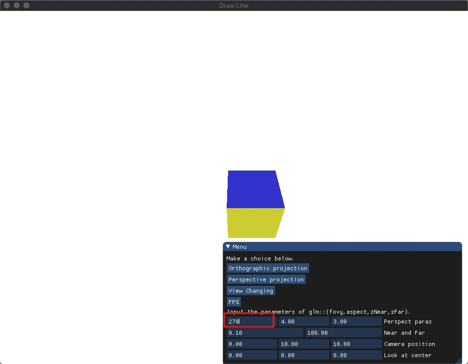

[TOC]

# Homework 5 - CameraHomework 5 - Camera

**演示视频：**

https://pan.baidu.com/s/1sC7M87soHqUAgF2aJxdqLg

## Basic:

### 1. 投影 (Projection):

- 把上次作业绘制的 cube 放置在 (-1.5, 0.5, -1.5) 位置，要求 6 个面颜色不一致 
- 正交投影 (orthographic projection)：实现正交投影，使用多组 (left, right, bottom, top, near, far) 参数， 比较结果差异 
- 透视投影 (perspective projection)：实现透视投影，使用多组参数，比较结果差异

------


#### 算法实现

1. 由于上次边长为 4 的正方体中心默认在世界坐标系的原点（model 矩阵为单位矩阵），在使用同样的 VAO 情况下，重新设置 model 矩阵如下：

   ```c++
   float cubeCenter[3] = { -1.5f, 0.5f, -1.5f };
   ...
   model = glm::translate(model, glm::vec3(cubeCenter[0], cubeCenter[1], cubeCenter[2]));
   ```

2. 6 个面颜色不一致已经在上次实验中实现，即在 36 个顶点数据中定义顶点坐标和顶点的 RGB 值，并添加颜色属性绑定到 VAO 上。

3. 正交投影使用的是 GLM 的内置函数 `glm::ortho` 实现，API 如下：

   ```c++
   // Creates a matrix for an orthographic parallel viewing volume.
   detail::tmat4x4<T> glm::gtc::matrix_transform::ortho	(	
     T const & 	left,
     T const & 	right,
     T const & 	bottom,
     T const & 	top,
     T const & 	zNear,
     T const & 	zFar 
   )	
   /***
   前两个参数指定了平截头体的左右坐标（x轴），第三和第四参数指定了平截头体的底部和顶部坐标（y轴）。通过这四个参数我们定义了近平面和远平面的大小，然后第五和第六个参数则定义了近平面和远平面的距离（z轴）。这个投影矩阵会将处于这些 x，y，z 值范围内的坐标变换为标准化设备坐标。
   ***/
   ```

4. 透视投影使用的是 GLM 的内置函数 `glm::perspective` 实现，API 如下：

   ```c++
   // Creates a matrix for a symetric perspective-view frustum.
   detail::tmat4x4<T> glm::gtc::matrix_transform::perspective	(	
   	T const & 	fovy,
   	T const & 	aspect,
   	T const & 	zNear,
   	T const & 	zFar 
   )		
   /***
   第一个参数定义了 fov 的值，它表示的是视野(Field of View)，并且设置了观察空间的大小。如果想要一个真实的观察效果，它的值通常设置为 45.0f，但想要一个末日风格的结果你可以将其设置一个更大的值。第二个参数设置了宽高比，由视口的宽除以高所得。第三和第四个参数设置了平截头体的近和远平面。我们通常设置近距离为 0.1f，而远距离设为 100.0f。所有在近平面和远平面内且处于平截头体内的顶点都会被渲染。
   ***/
   ```

5. 同样是从摄像机坐标系转换到 NDC 中，都需要经过两步骤：首先到裁剪坐标系中然后再通过透视除法到 NDC 中。不同的是，正交投影不会改变顶点坐标的 w 分量，所以可以理解为正射平截头体直接将平截头体内部的所有坐标映射到 NDC，而透视投影则需经过完整的两步：

   - 投影矩阵将给定的平截头体范围映射到裁剪空间，除此之外还修改了每个顶点坐标的 w 值，从而使得离观察者越远的顶点坐标 w 分量越大。被变换到裁剪空间的坐标都会在 -w 到 w 的范围之间（任何大于这个范围的坐标都会被裁剪掉）

   - 坐标在裁剪空间内之后，透视除法就会被应用到裁剪空间坐标上：

     

     从而转换到 NDC 中作为顶点着色器最后的输出

6. 我又定义了多组参数变量，其中由于每种投影平截头体的定义都涉及到其远近平面距离摄像机的距离，故统一为一个变量进行控制

   ```c++
   float ortho[4] = { -8.0f, 8.0f , -6.0f, 6.0f };
   float perspect[3] = {45.0f, SCR_WIDTH, SCR_HEIGHT};
   float near_far[2] = { 0.1f, 100.0f };
   ...
   projection = glm::ortho(ortho[0], ortho[1], ortho[2], ortho[3], near_far[0], near_far[1]);
   // 或者
   projection = glm::perspective(glm::radians(perspect[0]),perspect[1] / perspect[2],near_far[0],near_far[1]);
   ```

7. 为了方便改变多组参数对比结果，直接使用 GUI 进行设置

   ```c++
   ImGui::InputFloat4("Othro paras", ortho, 2);
   ImGui::InputFloat2("Near and Far", near_far, 2);
   // 或者
   ImGui::InputFloat3("Perspect paras", perspect, 2);
   ImGui::InputFloat2("Near and Far", near_far, 2);
   ```

8. 至此，model 和 projection 矩阵已经设置好了，为了更好地观察结果，通过加入摄像机中心位置和指向位置变量控制 view 矩阵。

   ```c++
   float camPos[3] = { 0.0f, 0.0f, 10.0f };
   float lookAtCenter[3] = {0.0f, 0.0f, 0.0f};
   ...
   ImGui::InputFloat3("Camera position", camPos, 2);
   ImGui::InputFloat3("Look at center", lookAtCenter, 2);
   ...
   view = glm::lookAt(
     glm::vec3(camPos[0], camPos[1], camPos[2]),
     glm::vec3(lookAtCenter[0], lookAtCenter[1], lookAtCenter[2]),
     glm::vec3(0.0f, 1.0f, 0.0f)
   );
   ```

9. 最后传入顶点着色器进行变换。

   ```c++
   shader.setMat4("model", glm::value_ptr(model));
   shader.setMat4("view",glm::value_ptr(view));
   shader.setMat4("projection", glm::value_ptr(projection));
   glBindVertexArray(VAO);
   glDrawArrays(GL_TRIANGLES, 0, 36);
   ```

------


#### 效果图

正交投影

参数1：

| left | right | bottom | top  | near | far  |
| ---- | ----- | ------ | ---- | ---- | ---- |
| -8   | 8     | -6     | 6    | 0.1  | 100  |


参数2：

| left | right | bottom | top  | near | far  |
| ---- | ----- | ------ | ---- | ---- | ---- |
| -10  | 10    | -10    | 10   | 0.1  | 100  |


参数3：

| left | right | bottom | top  | near | far  |
| ---- | ----- | ------ | ---- | ---- | ---- |
| -8   | 8     | -6     | 6    | 13   | 100  |


结果分析：

1. 如前所述，在进行正交投影时，不在平截头体之内的物体会被裁减，而前四个参数定义了这个平截头体的高度和宽度，投影后会得到 NDC 坐标，并且由右手坐标系转换为左手坐标系。所以**相同的物体在不同的平截头体投影后会得到不同的 NDC 坐标**，而由于最后一步是把 NDC 坐标映射到屏幕坐标，所以根据公式，平截头体的长宽比需要和视口的长宽比相同才会显示出正方体的样子，否则的话可以通过参数1 和参数 2 的对比发现，会产生高度和宽度不一样的映射结果。
2. 分析参数 1 和 参数 3 可以发现，当 far 太近或者 near 太远时，使得平截头体没能包裹住 Cube 的话，在视图中就看不见 Cube，或者出现穿模现象，图中红色为 Cube 的背面，粉色为 Cube 的底面。

------


透视投影

**注意为了观察的方便，第一个参数输入的单位是角度，在 projection 中需要用 glm::radians 转成弧度**

参数1：

| fov  | aspect | near | far  |
| ---- | ------ | ---- | ---- |
| 45   | 4：3   | 0.1  | 100  |


参数2：

| fov  | aspect | near | far  |
| ---- | ------ | ---- | ---- |
| 45   | 1：1   | 0.1  | 100  |


参数3：

| fov  | aspect | near | far  |
| ---- | ------ | ---- | ---- |
| 45   | 4：3   | 13   | 100  |


参数4：

| fov  | aspect | near | far  |
| ---- | ------ | ---- | ---- |
| 90   | 4：3   | 0.1  | 100  |


参数5：

| fov  | aspect | near | far  |
| ---- | ------ | ---- | ---- |
| 45   | 4：3   | 9.6  | 100  |


参数6：

| fov  | aspect | near | far  |
| ---- | ------ | ---- | ---- |
| 270  | 4：3   | 0.1  | 100  |




结果分析：

1. 同样采用控制变量的方法，通过参数 1 和参数 2 可以发现和之前正交投影相同的问题，由于 near 和 far 平面的长宽比造成的，我们可以根据 fov 和距离算出近平面的宽和高：

   

2. 通过参数 1 和参数 3 发现了穿模的问题，由于 near 距离摄像机太远导致。
3. 通过参数 1 和参数 4 发现 fov 增大时，视图能看到的范围越大，Cube 在视野中越小
4. 通过参数 1 和参数 6 发现 fov 的角度超过 180 度后，Cube 倒转过来
5. 改变摄像机位置，使其距离 Cube 为 9.5，调整 near 值，当大于 9.5 后，由于平截头体未能包住 Cube，造成穿模现象。
6. 最后和正交投影的结果进行比较发现，透视投影有近大远小的效果，可以轻松分辨出正面和上面。

------


### 2. 视角变换 (View Changing):

- 把 cube 放置在 (0, 0, 0) 处，做透视投影，使摄像机围绕 cube 旋转，并且时刻看着 cube 中心


#### 算法实现

1. 改变之前的 model 矩阵为单位矩阵

2. 定义围绕半径，并通过 $(Radius*sin(x))^2 + (Radius*cos(x))^2 = Radius^2$ 保证摄像机在 XoZ 平面的 一个半径为 Radius 的圆上。注视点保持在 (0, 0, 0)，传入 view 矩阵。保持投影矩阵为透视。

   ```c++
   float Radius = 10.0f;
   float camPosX = sin(glfwGetTime()) * Radius;
   float camPosZ = cos(glfwGetTime()) * Radius;
   ...
   view = glm::lookAt(
     glm::vec3(camPosX, 0.0f, camPosZ),
     glm::vec3(0.0f, 0.0f, 0.0f),
     glm::vec3(0.0f, 1.0f, 0.0f)
   );
   projection = glm::perspective(45.0f, (float)SCR_WIDTH / (float)SCR_HEIGHT, 0.1f, 100.0f);
   ```

------


#### 效果图


------


### 3. 在 GUI 里添加菜单栏，可以选择各种功能。

- 在正交投影和透视投影的模式下可以改变平截头体的多组参数和摄像机的位置和注视点。

- 在进入 FPS 模式后可以按 q 键退出，鼠标显示恢复正常。


------


### 4. 在现实生活中，我们一般将摄像机摆放的空间 View matrix 和被拍摄的物体摆设的空间 Model matrix 分开，但是在 OpenGL 中却将两个合二为一设为 ModelView matrix，通过上面的作业启发，你认为是为什么呢？在报告中写入。（Hints：你可能有不止一个摄像机）

> Older versions of OpenGL forced you to use *ModelView* and *Projection* transformations. The ModelView matrix combined the model and view transformations into one. I personally find it is easier to separate the two, so the view transformation can be modified independently of the model matrix.
>
> from：<https://open.gl/transformations>

> In the fixed functionality pipelines of old, you'd apply model and view together, then work out lighting using another result derived from them (with some fixes so that e.g. normals are still unit length even if you've applied some scaling to the object), then apply projection. You can see that reflected in OpenGL, which never separates the model and view matrices — keeping them as a single modelview matrix stack. You therefore also sometimes see that reflected in shaders.
>
> from：<https://stackoverflow.com/questions/5550620/the-purpose-of-model-view-projection-matrix>

------

在我看来主要原因有以下：

1. 对于不同的摄像机我们可能有不同的 view 矩阵，所以相同的物体需要通过不同的 ModelView 矩阵进行坐标转换，这就导致了计算量的减少，因为对于物体上的每一个顶点，如果分开的话需要进行两次矩阵乘法运算，如果有 n 个组成的话，需要 2n 次矩阵乘法运算，但当合二为一后，需要 n+1 次矩阵乘法运算，大大降低了计算复杂度。
2. 如上回答所说，之所以不组合 MVP 矩阵的原因可能是因为在投影前还需进行 lighting 的操作。


## Bonus

### 1. 实现一个 camera 类，当键盘输入 w,a,s,d ，能够前后左右移动；当移动鼠标，能够视角移动 ("look around") ， 即类似 FPS(First Person Shooting) 的游戏场景


#### 算法实现

1. 一个摄像机所包含的成员变量有：

   ```c++
   // Camera Attributes
   glm::vec3 Position;
   glm::vec3 Front;
   glm::vec3 Up;
   glm::vec3 Right;
   glm::vec3 WorldUp;
   // Euler Angles
   float Yaw;
   float Pitch;
   // Camera options
   float MovementSpeed;
   float MouseSensitivity;
   float Zoom;
   ```

   - 它在世界空间中的位置、观察的方向、一个指向它右测的向量以及一个指向它上方的向量。
   - 3 种欧拉角中的俯仰角 (Pitch)、偏航角 (Yaw)分别表示摄像机绕 x 和 y 轴旋转的角度
   - 其他控制变量

2. 当 Pitch 和 Yaw 变化时，更新摄像机的方向向量 Front，即更新摄像机的坐标轴位置。

   ```c++
    // Calculates the front vector from the Camera's (updated) Euler Angles
    void updateCameraVectors()
    {
      // Calculate the new Front vector
      glm::vec3 front;
      front.x = cos(glm::radians(Yaw)) * cos(glm::radians(Pitch));
      front.y = sin(glm::radians(Pitch));
      front.z = sin(glm::radians(Yaw)) * cos(glm::radians(Pitch));
      Front = glm::normalize(front);
      // Also re-calculate the Right and Up vector
      Right = glm::normalize(glm::cross(Front, WorldUp));  // Normalize the vectors, because their length gets closer to 0 the more you look up or down which results in slower movement.
      Up    = glm::normalize(glm::cross(Right, Front));
    }
   ```

3. 而 Pitch 和 Yaw 可以通过鼠标输入得到，通过回调函数来监听鼠标输入事件。每次监听到事件之后就改变 xoffset 和 yoffset 来改变俯仰角 (Pitch) 和偏航角 (Yaw) ，从而改变摄像机的位置。

   ```c++
   void mouse_callback(GLFWwindow* window, double xpos, double ypos){
       if(firstMouse)
       {
           lastX = xpos;
           lastY = ypos;
           firstMouse = false;
       }
   
       float xoffset = xpos - lastX;
       float yoffset = lastY - ypos; 
       lastX = xpos;
       lastY = ypos;
   
       camera.ProcessMouseMovement(xoffset,yoffset);
   }
   ```

4. 同理注册鼠标滚轮的回调函数，通过更新 Zoom，改变 projection 矩阵的 fov 视野产生缩放的效果

   ```c++
   void scroll_callback(GLFWwindow* window, double xoffset, double yoffset)
   {
       camera.ProcessMouseScroll(yoffset);
   }
   ```

5. 同理在 processInput 中加入对 wasd 和 q 的监听，使摄像机自由移动，q 用于退出 FPS mode。

   ```c++
   void processInput(GLFWwindow *window)
   {
       if(glfwGetKey(window, GLFW_KEY_ESCAPE) == GLFW_PRESS){
           glfwSetWindowShouldClose(window, true);
       }
       if(glfwGetKey(window, GLFW_KEY_Q) == GLFW_PRESS){
           glfwSetInputMode(window, GLFW_CURSOR, GLFW_CURSOR_NORMAL);
           isFPS = false;
           choice = 0;
       }
       
       if (glfwGetKey(window, GLFW_KEY_W) == GLFW_PRESS){
           camera.ProcessKeyboard(FORWARD,deltaTime);
       }
       if (glfwGetKey(window, GLFW_KEY_S) == GLFW_PRESS){
           camera.ProcessKeyboard(BACKWARD,deltaTime);
       }
       if (glfwGetKey(window, GLFW_KEY_A) == GLFW_PRESS){
           camera.ProcessKeyboard(LEFT,deltaTime);
       }
       if (glfwGetKey(window, GLFW_KEY_D) == GLFW_PRESS){
           camera.ProcessKeyboard(RIGHT,deltaTime);
       }
   }
   ```

6. 添加时间变量，并在渲染循环中更新，记录渲染上一帧所用的时间，以平衡在不同机器上的移动速率。

   ```c++
   // time
   float deltaTime = 0.0f; // 当前帧与上一帧的时间差
   float lastFrame = 0.0f; // 上一帧的时间
   ...
   float currentFrame = glfwGetTime();
   deltaTime = currentFrame - lastFrame;
   lastFrame = currentFrame;
   ```

7. 最后可以在主函数中定义 Camera 对象。当进入 FPS 模式时，需要隐藏光标，并捕捉 (Capture) 它，通过 GetViewMatrix 得到 view 矩阵。

   ```c++
   // Camera
   Camera camera(glm::vec3(0.0f, 0.0f, 10.0f));
   float lastX = SCR_WIDTH / 2;
   float lastY = SCR_HEIGHT / 2;
   bool firstMouse = true;
   ...
   if(isFPS){
       glfwSetInputMode(window, GLFW_CURSOR, GLFW_CURSOR_DISABLED);
   }
   view = camera.GetViewMatrix();
   projection = glm::perspective(glm::radians(camera.Zoom),(float)SCR_WIDTH / (float)SCR_HEIGHT, 0.1f, 100.0f);
   ```

------


#### 效果图

进入到 Cube 内部后：


通过鼠标的自由视野和键盘的自由移动同时操作后移动到 Cube 上方


