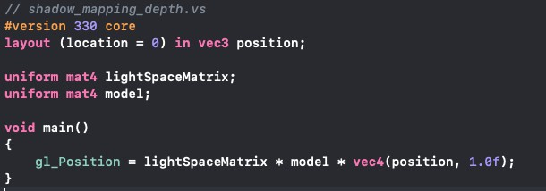

[TOC]

# Homework 7 - Shadowing Mapping

**最终改进后的效果展示**：https://pan.baidu.com/s/1Gf9Uq7qavxq0gz-HlMZrig

**或见 doc/demo.mov**

## Basic:

### 1. 实现方向光源的 Shadowing Mapping:

- 要求场景中至少有一个 object 和一块平面(用于显示shadow) 

1. 添加平面的顶点数据，并绑定 VAO 和 VBO

   ```c++
   float planeVertices[] = {
     // Positions            // Normals       
     25.0f, -2.0f, 25.0f,    0.0f, 1.0f, 0.0f,
     -25.0f, -2.0f, -25.0f,  0.0f, 1.0f, 0.0f, 
     -25.0f, -2.0f, 25.0f,   0.0f, 1.0f, 0.0f,
   
     25.0f, -2.0f, 25.0f,    0.0f, 1.0f, 0.0f,
     25.0f, -2.0f, -25.0f,   0.0f, 1.0f, 0.0f,
     -25.0f, -2.0f, -25.0f,  0.0f, 1.0f, 0.0f
   };
   ```

2. 每次渲染场景的时候绘制一个平面和两个 Cube，其中为了方便观察效果，设置不同的 Transform 让每个 Cube 有不同的角度。

   

------


- 光源的投影方式任选其一即可

1. 保留上次实验的光源物体渲染和 Phong Shading ，可以设置不同的光照参数传递给着色器。

2. 阴影渲染的第一步：生成深度贴图。从光源的透视图来渲染场景，并把深度值的结果储存到纹理，而储存在纹理中的所有这些深度值，叫做深度贴图（depth map）或阴影贴图。

3. 其中创建帧缓冲对象和 2D 纹理按照教程操作即可，注意将深度贴图的环绕方式从 GL_REPEAT 改为 GL_CLAMP_TO_BORDER，保证以设置的边框颜色（白色）渲染超出深度贴图的坐标，而不会发生纹理图片重复渲染。当一个点比光的平截头体的远平面还要远时，它的投影坐标的z坐标大于1.0，需要把 shadow 的值强制设为 0.0。

   没有进行以上两步设置的结果：

   

   

4. 首先定义 lightSpaceMatrix，转换到以光源为视角的空间，其中可以选择透视投影矩阵或者正交投影矩阵来分别模拟点光源或者平行光源。注意保证投影视锥（frustum）的大小，以包含打算在深度贴图中包含的物体。当物体和片元不在深度贴图中时，它们就不会产生阴影。

   


5. 然后渲染深度贴图，注意调用 glViewport。因为阴影贴图经常和我们原来渲染的场景（通常是窗口解析度）有着不同的解析度，我们需要改变视口（viewport）的参数以适应阴影贴图的尺寸。其中需要设置一个只关心深度值的简单着色器来进行渲染，详见 *shadow_mapping_depth.vs* 和 *shadow_mapping_depth.fs*

   

   

------


5. 阴影渲染的第二步：生成阴影。以 Camera 视角渲染场景，使用 Shadowing Mapping 算法(比较当前深度值与在DepthMap Texture 的深度值)，决定某个点是否在阴影下。

6. 修改 glViewPort 回屏幕的大小。

   

7. 然后使用之前渲染好的深度贴图对原图进行渲染即可，这时候需要用到之前的 Phong Shader，并修改其完成 Shadowing Mapping 算法。

   

------


- 在报告里结合代码，解释 Shadowing Mapping 算法 

1. Shadowing Mapping 用来检验一个片元是否在阴影之中，首先需要在顶点着色器中进行光空间的变换，除了计算顶点正常着色需要的世界空间顶点位置 vs_out.FragPos 之外，还需传递一个光空间的vs_out.FragPosLightSpace 给像素着色器。

   

2. 在片段着色器中，通过从顶点着色器传来的 FragPosLightSapce  和 uniform 传进来的深度贴图 shadowMap , 计算 shadow 值（详见下面第三步的 shadowCalculation 函数）。当 fragment 在阴影中时是1.0，在阴影外是0.0。然后，diffuse 和 specular 颜色会乘以（1- shadow），表示这个片元有多大成分不在阴影中。由于阴影不会是全黑的（由于散射），把 ambient 分量从乘法中剔除。

   

3. 声明一个 shadowCalculation 函数，用它计算阴影。首先要检查一个片元是否在阴影中，需要把光空间片元位置转换为裁切空间的标准化设备坐标。（原因是裁切空间的 FragPosLightSpace 并不会通过 gl_Position 传到像素着色器里，所以需要手动执行）

   

4. 为了和深度贴图的深度相比较，z 分量需要变换到[0,1]；为了作为从深度贴图中采样的坐标，xy 分量也需要变换到[0,1]。所以整个 projCoords 向量都需要变换到[0,1]范围。

   

5. 计算光的位置视野下最近的深度 closestDepth 并和片元的当前深度 currentDepth 做比较，如果 currentDepth 大于 closetDepth，那么片元就在阴影中。

   

6. 平行光源的效果如下（正交投影）

   

7. 点光源的效果如下（透视投影）

   


**因为让所有超出深度贴图的坐标的深度范围是1.0，这样超出的坐标将永远不在阴影之中。所以通过平面上的交替黑线可以清晰看出深度贴图的大小。**


8. 因为当一个点比光视锥体的远平面还要远时，它的投影坐标的 z 坐标大于1.0。进行如下设置，保证其 shadow 的值为0.0。

   

   改进效果如下：

   

------


### 2. 修改GUI

之前的光照参数和 FPS 模式保持不变，可以选择两种光源：点光源和平行光源，分别对应透视和正交投影。


------


## Bonus:

### 1. 实现光源在正交/透视两种投影下的 Shadowing Mapping

实现过程只需要修改光空间的 lightProjection 矩阵分别为正交投影或者透视投影即可，详见上面。

注意我们需要将透视投影矩阵的视角设置的小一点，这样光的视野更加开阔，保证阴影在深度贴图内部。


------


### 2. 优化 Shadowing Mapping (可结合 References 链接，或其他方法。优化方式越多越好，在报告里说明，有加分)


#### 改进1: 使用**阴影偏移**（shadow bias）修复阴影失真(Shadow Acne)

因为阴影贴图受限于解析度，在距离光源比较远的情况下，多个片元可能从深度贴图的同一个值中去采样。所以当光源以一个角度朝向表面的时候就会出现相同深度的片元和不同深度的深度贴图去比较，造成不真实的阴影。

一种简单的解决办法就是对表面的深度（或深度贴图）应用一个偏移量，这样所有采样点都获得了比表面深度更小的深度值，整个表面就正确地被照亮，但是有些表面坡度很大，仍然会产生阴影失真。一个更加可靠的办法能够根据表面朝向光线的角度更改偏移量，类似之前光照模型的 diffuse 计算，光的方向与片元法向量的夹角越大，偏移量需要的也越大。


改进效果如下：


------


#### 改进2: 调整光空间的投影视锥体大小获得更好的深度贴图解析度

使用阴影偏移的一个缺点是对物体的实际深度应用了平移。以至于可以看出阴影相对实际物体位置的偏移，如下所示，产生了物体悬浮在表面的现象。


根据教程，使用正面剔除（front face culling）修复悬浮 (Peter Panning)，具体解决办法是当渲染深度贴图时候开启正面剔除，即剔除立方体的正面，但是因为地面是一个单独的平面，不会被完全剔除，所以之前在平面上阴影偏移的效果无改进，在立方体上工作的很好。

```c++
glCullFace(GL_FRONT);
//[...] RenderSceneToDepthMap 
glCullFace(GL_BACK); // 不要忘记设回原先的culling face
```

**但是，发现前后不管是在立方体上的阴影还是在地面上的阴影效果和之前的一模一样，怀疑是没有正确开启正面剔除，果然教程少了如下几句。**

```c++
glEnable(GL_CULL_FACE);
glCullFace(GL_FRONT);
//[...] RenderSceneToDepthMap 
glCullFace(GL_BACK);
glBindFramebuffer(GL_FRAMEBUFFER, 0);
glDisable(GL_CULL_FACE);
```

**开启后，发现效果变得更差了，仔细一想，感觉会加重悬浮，因为背面的深度值要比正面的大，所以和之前的作用方向相同，都是增加深度贴图相同位置的深度值再和 currenDepth 做对比。**


------

**一种解决办法是减少光空间中投影视锥体的大小，但要保证包含摄像机的投影视锥体，下面情况中左边的表现要明显优于右边。**


这样的话，深度贴图就会变小，总体像素点的个数不变，每个像素大小就会减少，在正常摄像机下渲染时，每个深度贴图像素的深度值就会对应更少的片元，增加解析度。


远平面从 100.0f 减少到 30.f 后


如下所示，悬浮现象减少了许多，并且其他地方也有改进。


------


#### 改进3: 使用 PCF（percentage-closer filtering）柔和阴影

因为深度贴图有一个固定的解析度，多个片元对应于一个纹理像素。结果就是多个片元会从深度贴图的同一个深度值进行采样，这几个片元便得到的是同一个阴影，这就会产生锯齿边。如下所示：


一种 PCF 是对于当前纹理坐标的 3 邻域进行平均采样，即片元深度值与 9 个不同纹理坐标的深度值进行比较计算 shadow 值最后取平均。

下面的 textureSize 返回一个给定采样器纹理的0级 mipmap 的 vec2 类型的宽和高。用1除以它返回一个单独纹理像素的大小，用以对纹理坐标进行偏移，确保每个新样本，来自不同的深度值。

可以使用更多的样本，更改 texelSize 变量，就可以增加阴影的柔和程度。


改进效果如下：


------


#### 改进4: 增加深度贴图解析度的方式来降低锯齿块

提高 deepthMap 的分辨率，使像素点更多，减少多个片元对同一个纹理坐标进行取样。


在之前的改进之上改进效果如下：

