# Homework 8 - Bezier Curve

**效果视频：**见 doc/demo.mov 或 https://pan.baidu.com/s/1vNpMIsC47bXJgTzDO2YGfA

## Basic:

> 1. 用户能通过左键点击添加 Bezier 曲线的控制点，右键点击则对当前添加的最后一个控制点进行消除
> 2. 工具根据鼠标绘制的控制点实时更新 Bezier 曲线。

### 效果展示：

1. 用户点击鼠标左键添加控制点，右键对当前添加的最后一个控制点进行消除，Bezier 曲线实时更新。

   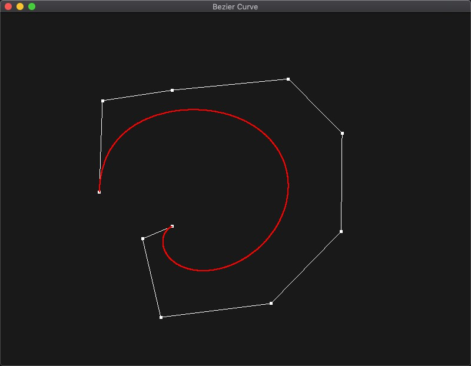

   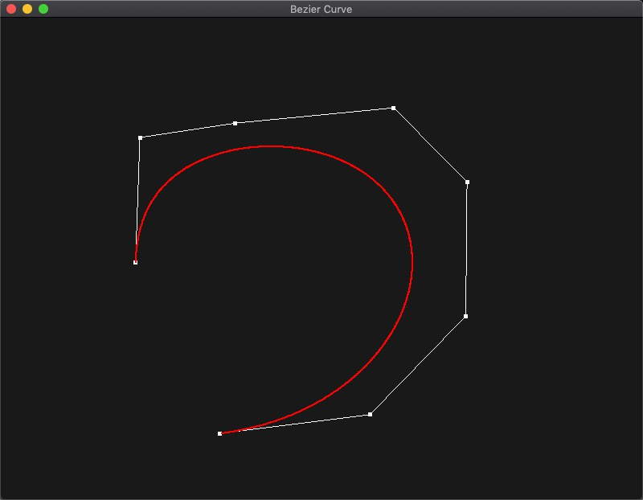

   

2. 当鼠标光标移动到控制点的附近时，可以进行拖拽以改变控制点的位置。

   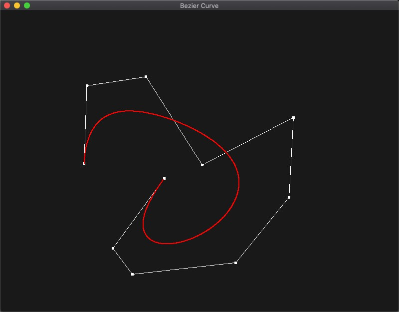

------

### 实现步骤：

1. 添加全局变量 `vector<glm::vec3> controlPoints;` 存储所有控制点的坐标。控制点的添加和删除可以通过在GLFW 中监听鼠标输入的回调函数中完成。

   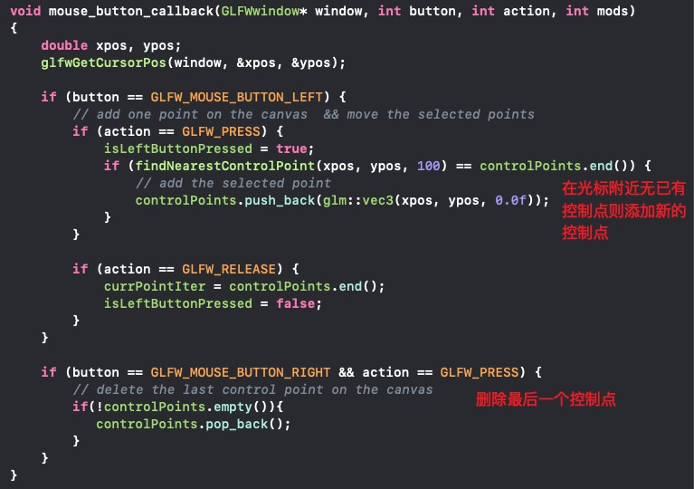

   其中 `findNearestControlPoint` 会遍历所有控制点的位置，以粗略查找点击范围中是否有可以控制的点，有的话则返回最近的控制点的 iterator。

   

2. 在渲染循环中，完成控制点坐标的实时改变。

   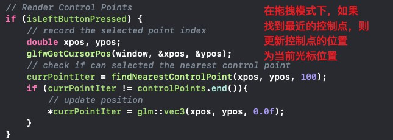

   

3. 在渲染之前，将 controlPoints 中的屏幕坐标转换到 NDC 坐标系下的坐标，并存储为包含顶点数据的 float 数组。

   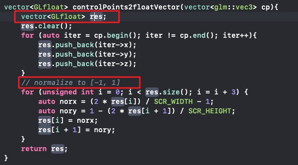

   

4. 然后就可以将控制点渲染出来了，每次需要同时绘制点和之间的连线。

   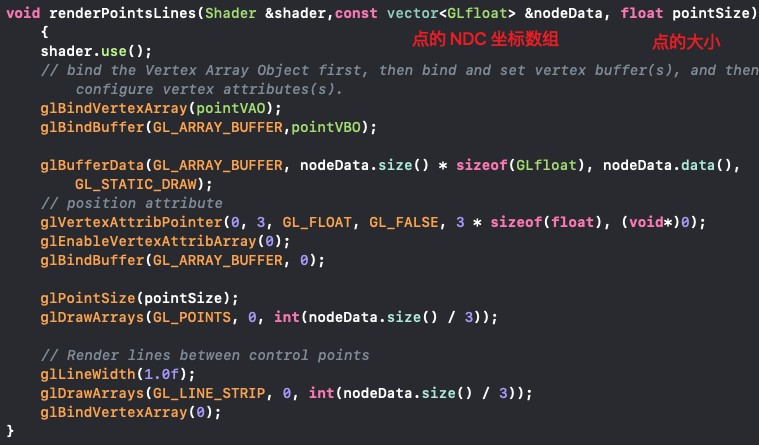

5. 下面画 Bezier 曲线，如下所示的参数方程，曲线上的点的坐标可以由控制点插值生成，每个0-1之间的 t 值可以生成曲线上的一个点。

   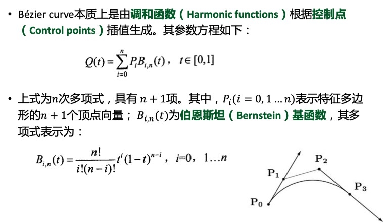

   建立 curveShader，首先接受控制点的个数，所有控制点的 NDC 坐标和当前 t 值，然后在片段着色器中计算伯恩斯坦基函数，最后对控制点的坐标进行插值，得到对应的曲线上的点的坐标。

   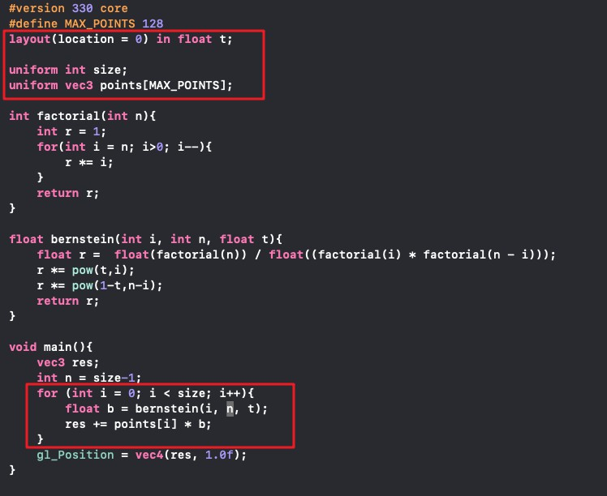

6. 在渲染循环中传入 uniform 变量给 curveShader 即可以完成实时更新。

------

## Bonus

> 可以动态地呈现Bezier曲线的生成过程。

### 效果展示

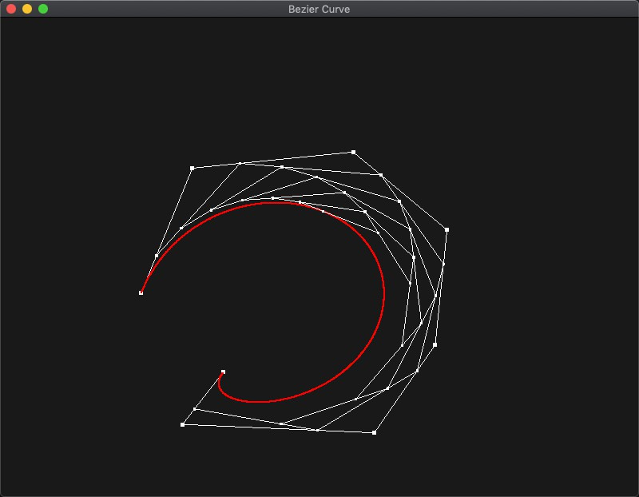

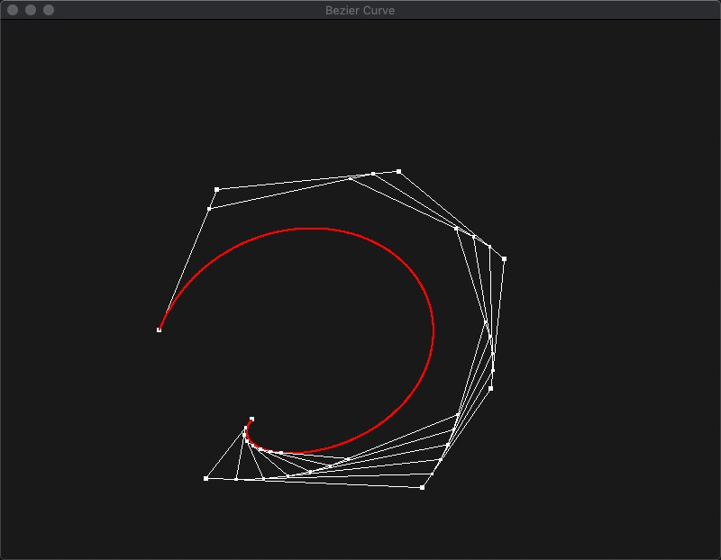

------

### 实现步骤

1. 添加对键盘 D 键输入的处理，可以将模式切换到动态模式。

   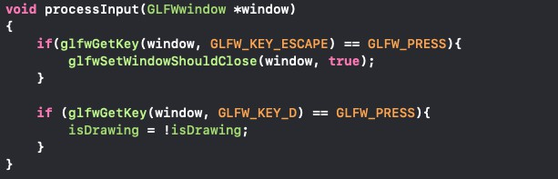

   

2. 添加 `void draw_process(vector<glm::vec3> points, float t)` 函数，对于给定的 t，先在输入的 n + 1 个点形成的 n 条线上各取⽐例为 t 的点，即 $(1 − t)P_{i−1} + tP_i$ ，得到 n 个点，然后再去渲染这 n 个点和它们之间的连线。最后再⽤这 n 个点递归调⽤ draw_process，t 不变，执⾏相同的过程，最后得到的点就在 Bezier 曲线上。

   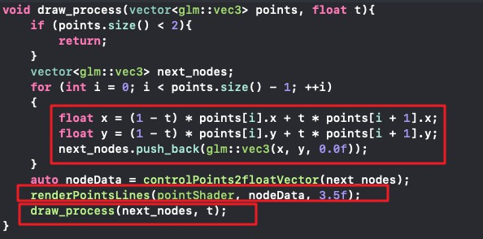

3. 在渲染循环中，当进入动态模式时，首先停⽌捕捉⿏标状态，并让 t 从 0 开始，每个渲染循环增加 0.0005，最后传入当前控制点和 t 给 `draw_process` 进行递归画线。退出动态模式后，重新可以捕捉⿏标状态，并重置 t 为0，保证更新控制点后可以重新显示动画。

   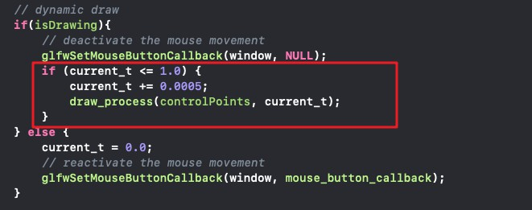