[TOC]

# Homework 6 - Lights and Shading

## 效果展示

见 doc/demo.mov

https://pan.baidu.com/s/1bqB3Q7NT1ceNuJeKmKy0LQ

## Basic:

### 1. 实现 Phong 光照模型：

- 场景中绘制一个 cube 

1. Cube 的顶点数据在上次的基础上去掉颜色属性，加入每个顶点的法向量坐标，并更新顶点属性指针。
2. Cube 作为被投光 (Cast the light) 的对象，还需要一个物体来代表光源在 3D 场景中的位置。首先为这个灯创建一个专门的 VAO（与 Cube 使用相同的 VBO），然后为了灯的颜色不受到影响，为灯的绘制创建另外的一套着色器，在其片段着色器中将光源设置为白色。最后在物体的片段着色器中加入 objectColor 和 lightColor的 uniform 变量，当把光源的颜色与物体的颜色值相乘，所得到的就是这个物体所反射的颜色（也就是我们所感知到的颜色）。
3. 分别定义不同的 model 矩阵，将物体和光源的位置区别，view 和 projection 矩阵则保持相同。
4. 最后将各个变量传入相对应的着色器中进行渲染。

这里为了可以自由切换 FPS 模式，定义了 currentView 和 currentProjection 矩阵，并实时记录当前的 view 和 projection 矩阵，当退出 FPS 模式时，可以保持当前的视野不变，并且此时鼠标和键盘的回掉函数不会记录改变量，从而当再次进入 FPS 模式时，会从当前位置进行移动。

------


- 自己写 shader 实现两种 shading: Phong Shading 和 Gouraud Shading，并解释两种 shading 的实现原理 

1. 冯氏光照模型的主要结构由3个分量组成：环境 (Ambient)、漫反射 (Diffuse) 和镜面 (Specular) 光照。

2. 其中 Ambient 直接将 ambientStrength 和 lightColor 相乘即可，效果如下：

   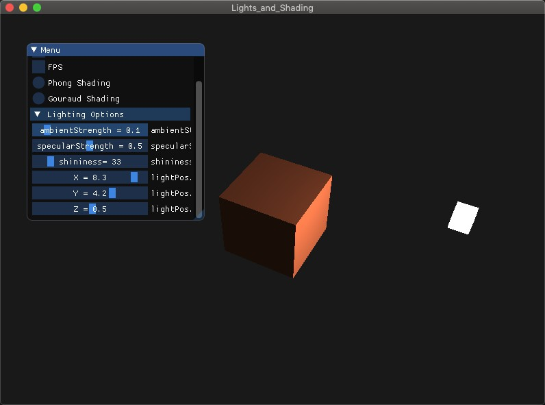

   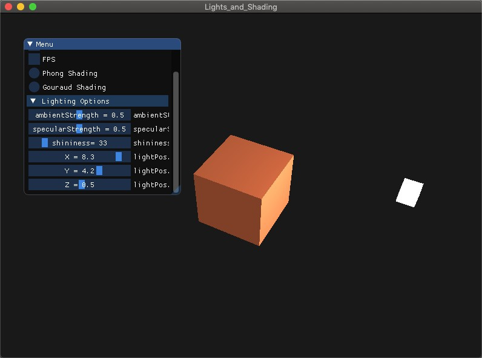

   由于光可以向很多方向发散并反弹，从而能够到达不是非常直接临近的点，产生环境光照，当使用很小的常量（光照）颜色，添加到物体片段的最终颜色中时，即便场景中没有直接的光源也能看起来存在有一些发散的光。上述实现了此效果，并且随着 ambientStrength 的增加，发散光的强度越高。

   ------

   

3. Diffuse 的计算需要用到以下两个单位向量：

   - 法向量：一个垂直于顶点表面的向量。
   - 定向的光线：作为光源的位置与片段的位置之间向量差的方向向量。为了计算这个光线，我们需要光的位置向量和片段的位置向量。

   法向量已经定义，光的位置向量即为灯的 Position，而片段的位置向量 FragPos 则可以由以下计算得到：

   ```c++
   FragPos =  vec3(model * vec4(aPos, 1.0f));
   ```

   最后计算因子

   ```c++
   // Diffuse Lighting
   vec3 norm = normalize(Normal);
   vec3 lightDir = normalize(lightPos - FragPos);
   float diff = max(dot(norm, lightDir), 0.0);
   vec3 diffuse = diff * lightColor;
   ```

   **注意，为了（只）得到两个向量夹角的余弦值，我们使用的是单位向量（长度为1的向量），所以我们需要确保所有的向量都是标准化的，否则点乘返回的就不仅仅是余弦值了。并且使用 max 函数保证漫反射分量不会变成负数。**

   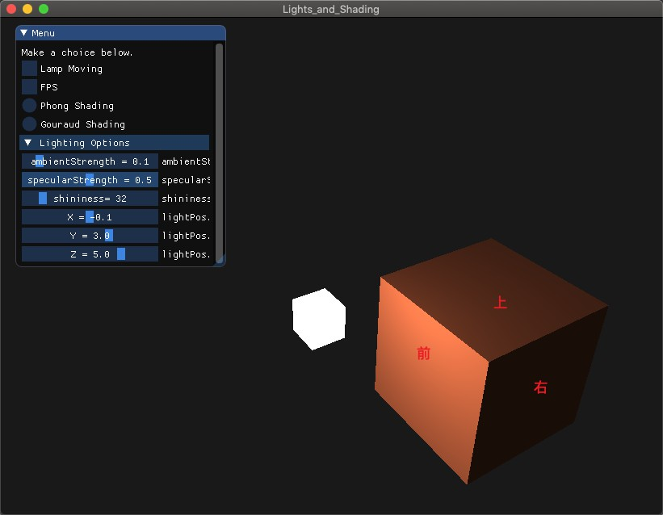

   从上图发现，光源的方向向量和 Cube 前面的法向量的余弦值大于和上面的，即法向量和光的方向向量之间的夹角小，所以其漫反射的程度强，如果光线垂直于物体表面，这束光对物体的影响会最大化，但和右面法向量的余弦值小于0，这时只有环境光照发挥作用了。

   ------

   

4. 如果对物体进行了不等比缩放，还需要使用法线矩阵去乘以法向量。

   ```c++
   Normal = mat3(transpose(inverse(model))) * aNormal;
   ```

5. Specular 的计算需要用到以下向量：

   - 观察者的世界空间坐标 viewPos
   - 片段的位置向量 FragPos

   计算如下：

   ```c++
   // Specular Highlight
   vec3 viewDir = normalize(viewPos - FragPos);
   vec3 reflectDir = reflect(-lightDir, norm);
   float spec = pow(max(dot(viewDir, reflectDir), 0.0), shininess);
   vec3 specular = specularStrength * spec * lightColor;
   ```

   这其中有两个常量 ：

   - 表示镜面强度 (Specular Intensity) 的 specularStrength
   - 反光度 (Shininess)，一个物体的反光度越高，反射光的能力越强，散射得越少，高光点就会越小。

   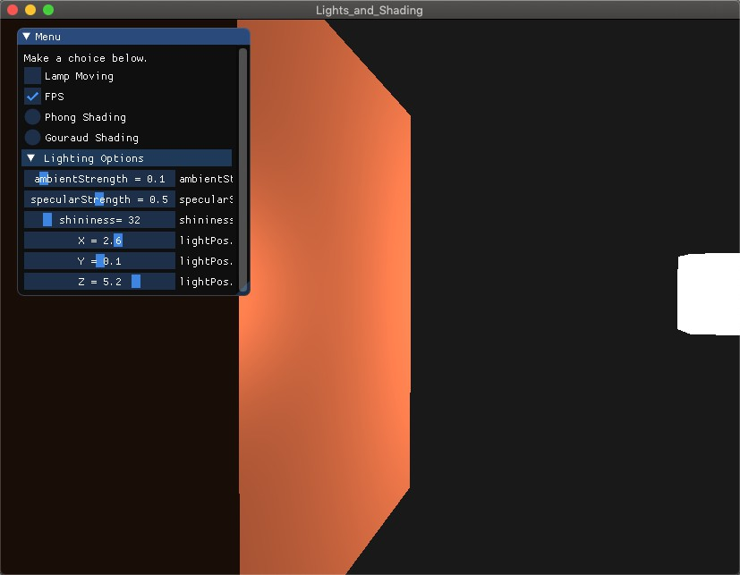

   

   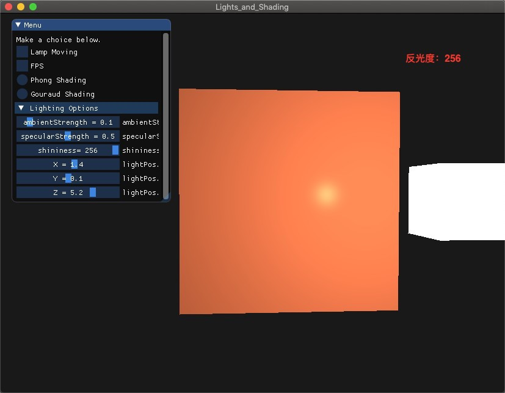

   通过以上前两个图可以发现，如果视角和反射光的夹角越小，那么镜面光的影响就会越大。它的作用效果就是，当我们去看光被物体所反射的那个方向的时候，我们会看到一个高光，通过后两个图可以发现，反光度越高，反射光的能力越强，散射得越少，高光点就会越小。

   ------

   

不管是 Phong Shading 还是 Gouraud Shading 都是使用的上述**冯氏光照模型**，不同的是在光照着色器的早期，开发者曾经在顶点着色器中实现冯氏光照模型，即为 Gouraud 着色，在顶点着色器中做光照的优势是，相比片段来说，顶点要少得多，因此会更高效，所以（开销大的）光照计算频率会更低，然后做双线性内插（bilinear interpolation）来求得片段的颜色，使整个三角形有渐层的颜色变化。然而，顶点着色器中的最终颜色值是仅仅只是那个顶点的颜色值，片段的颜色值是由插值光照颜色所得来的。结果就是这种光照看起来不会非常真实，除非使用了大量顶点。而当我们将光照的计算放到片段着色器中时，就变为了 Phong 着色，能产生更平滑的光照效果，它先对三角形整个面作法向量的双线性内插，接着在每个片段中利用冯氏光照模型求得其颜色。具体见 Shader/。

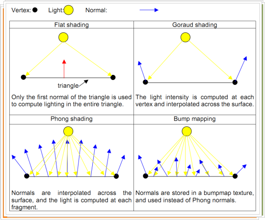


当高光点不在三角形的顶点附近时，使用 Gouraud Shading 高光点会消失，这是因为中间的片段颜色是由顶点的颜色插值造成的

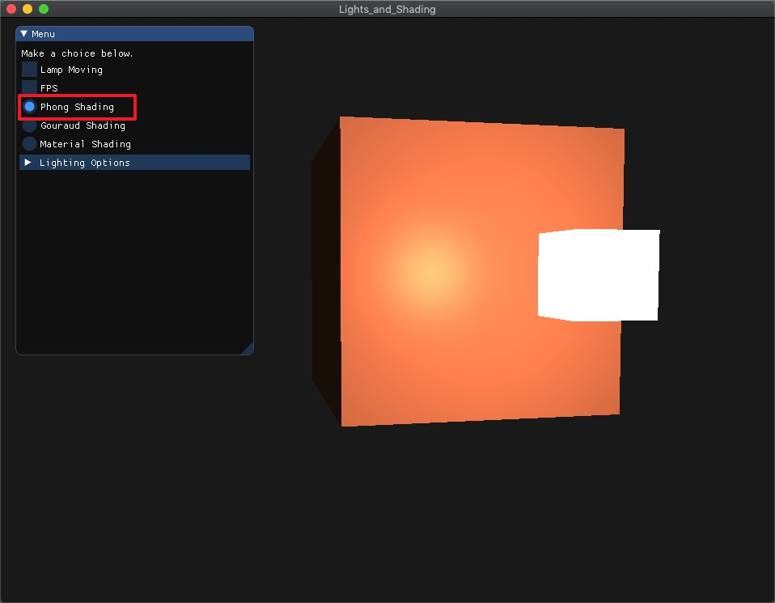

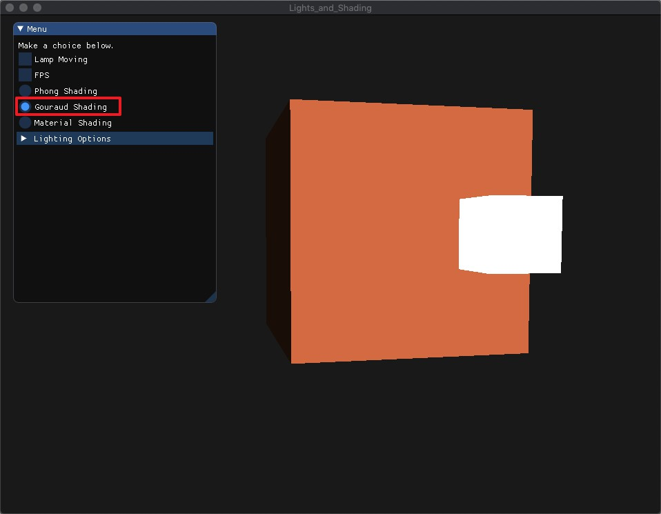


而当高光点在顶点附近时，Gouraud Shading 的高光会覆盖较多的区域，且有沿着对角线渐变的效果。

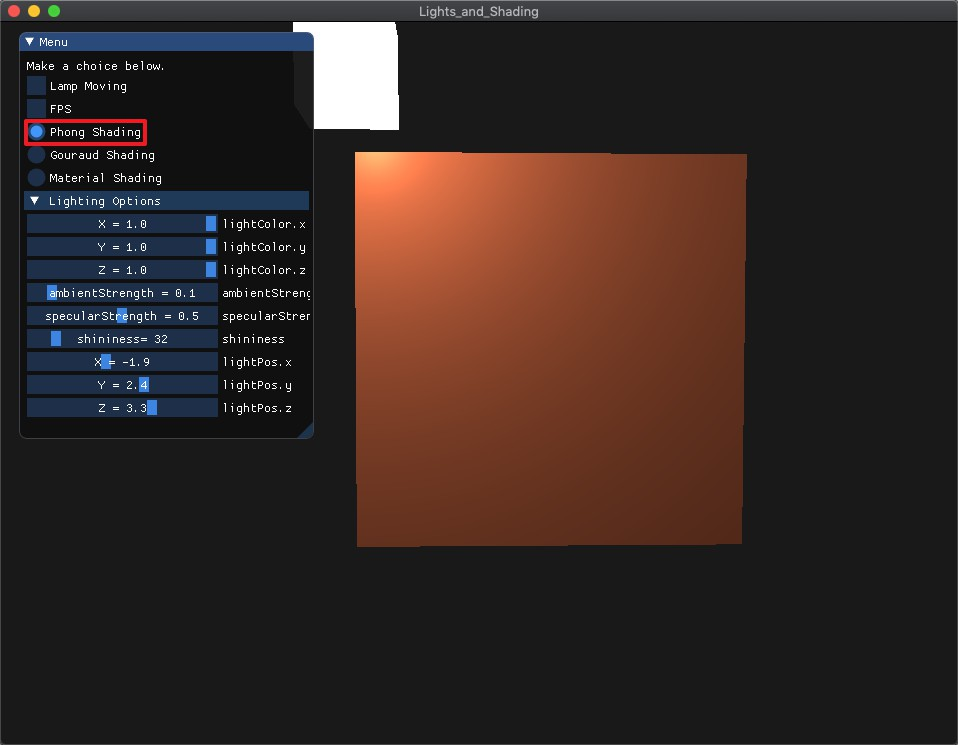

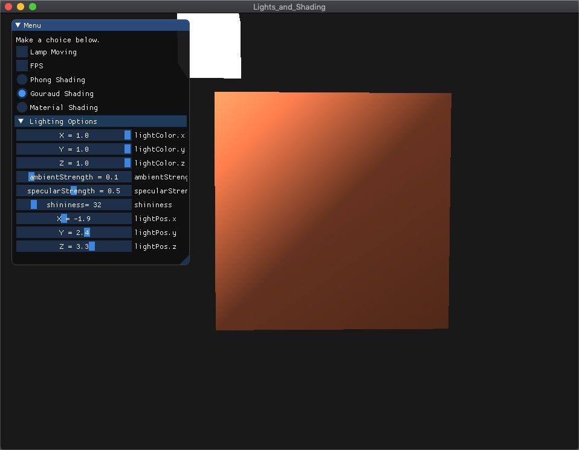

总而言之，Phong Shading 的效果要好，但计算开销大，如今GPU发展迅速，Phong Shading 的效能已得到提升。

------


### 2. 使用GUI，使参数可调节，效果实时更改：

- GUI 里可以切换两种 shading 


添加另一个 Shader：

1. 为每个物体分别定义一个材质 (Material) 属性，用三个分量来定义一个材质颜色 (Material Color) ，还有反光度。

   - ambient 材质向量定义了在**环境光照下这个物体反射得是什么颜色**，通常这是和物体颜色相同的颜色。
   - diffuse 材质向量定义了在**漫反射光照下物体的颜色**。（和环境光照一样）漫反射颜色也要设置为我们需要的物体颜色。
   - specular 材质向量设置的是**镜面光照对物体的颜色影响**（或者甚至可能反射一个物体特定的镜面高光颜色）。
   - shininess 影响镜面**高光的散射/半径**。

   将环境光和漫反射分量设置成物体所拥有的颜色，而将镜面分量设置为一个中等亮度的颜色。

2. 为光照添加一个属性，用三个分量表示光源对环境光、漫反射和镜面光分量的不同强度

   - ambient，**环境光照通常会设置为一个比较低的强度**，因为我们不希望环境光颜色太过显眼。
   - diffuse，**光源的漫反射分量通常设置为光所具有的颜色**，通常是一个比较明亮的白色。
   - specular，**镜面光分量通常会保持为`vec3(1.0)`，以最大强度发光。**

根据选择使用三种不同的 Shader 进行渲染


- 使用如进度条这样的控件，使 ambient 因子、diffuse 因子、specular 因子、反光度等参数可调节，光照效 果实时更改

Phong Shading 和 Gouraud Shading 的参数


Material Shading 的参数

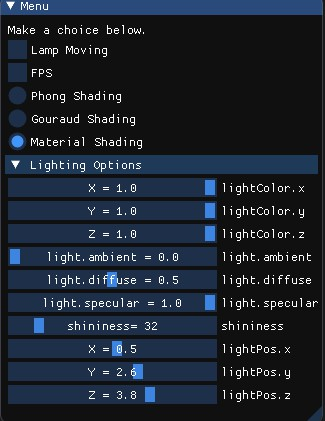


## Bonus:

### 1. 当前光源为静止状态，尝试使光源在场景中来回移动，光照效果实时更改。

将上次摄像机的圆周移动应用到光源上，实时更新 lightPos，效果见录屏。

```c++
// Lighting moving
float Radius = 10.0f;
float lampPosX = sin(glfwGetTime()) * Radius;
float lampPosZ = cos(glfwGetTime()) * Radius;

if(isLightMoving){
  lightPos.x = lampPosX;
  lightPos.z = lampPosZ;
}
```

